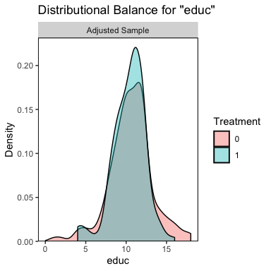
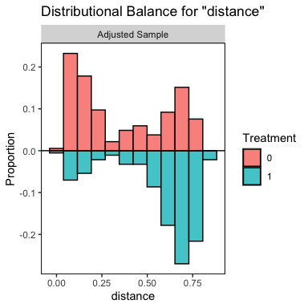

<!-- README.md is generated from README.Rmd. Please edit that file -->

```{r, echo = FALSE}
knitr::opts_chunk$set(
  collapse = FALSE,
  warning = FALSE,
  message = FALSE,
  tidy = TRUE,
  fig.align='center',
  comment = "#>",
  fig.path = "man/figures/README-"
)
#if (!requireNamespace("MatchIt")) knitr::opts_chunk$set(eval = FALSE)
```
# cobalt 

#### Covariate Balance Tables and Plots
[](https://cran.r-project.org/package=cobalt) [](https://cran.r-project.org/package=cobalt)

------

Welcome to `cobalt`, which stands for **Co**variate **Bal**ance **T**ables (and Plots). `cobalt` allows users to assess balance on covariate distributions in preprocessed groups generated through weighting, matching, or subclassification, such as by using the propensity score. `cobalt`'s primary function is `bal.tab()`, which stands for "balance table", and is meant to replace (or supplement) the balance assessment tools found in other R packages. To examine how `bal.tab()` integrates with these packages and others, see the help file for `bal.tab()` with `?bal.tab`, which links to the methods used for each package. Each page has examples of how `bal.tab()` is used with the package. There are also five vignettes detailing the use of `cobalt`, which can be accessed at `vignettes("cobalt")`: one for basic uses of `cobalt`, one for the use of `cobalt` with additional packages, one for the use of `cobalt` with multiply imputed and/or clustered data, one for the use of `cobalt` with longitudinal treatments, and one for the use of `cobalt` to generate publication-ready plots. Currently, `cobalt` is compatible with output from `MatchIt`, `twang`, `Matching`, `optmatch`, `CBPS`, `ebal`, `WeightIt`, `designmatch`, `sbw`, `MatchThem`, and `cem` as well as data not processed through these packages.

## Why cobalt?

Most of the major conditioning packages contain functions to assess balance; so why use `cobalt` at all? `cobalt` arose out of several desiderata when using these packages: to have standardized measures that were consistent across all conditioning packages, to allow for flexibility in the calculation and display of balance measures, and to incorporate recent methodological recommendations in the assessment of balance. In addition, `cobalt` has unique plotting capabilities that make use of `ggplot2` in R for balance assessment and reporting.

Because conditioning methods are spread across several packages which each have their idiosyncrasies in how they report balance (if at all), comparing the resulting balance from various conditioning methods can be a challenge. `cobalt` unites these packages by providing a single, flexible tool that intelligently processes output from any of the conditioning packages and provides the user with both useful defaults and customizable options for display and calculation. `cobalt` also allows for balance assessment on data not generated through any of the conditioning packages. In addition, `cobalt` has tools for assessing and reporting balance for clustered data sets, data sets generated through multiple imputation, and data sets with a continuous treatment variable, all features that exist in very limited capacities or not at all in other packages. 

A large focus in developing `cobalt` was to streamline output so that only the most useful, non-redundant, and complete information is displayed, all at the user's choice. Balance statistics are intuitive, methodologically informed, and simple to interpret. Visual displays of balance reflect the goals of balance assessment rather than being steps removed. While other packages have focused their efforts on processing data, `cobalt` only assesses balance, and does so particularly well.

New features are being added all the time, following the cutting edge of methodological work on balance assessment. As new packages and methods are developed, `cobalt` will be ready to integrate them to further our goal of simple, unified balance assessment.

## Examples

Below are examples of `cobalt`'s primary functions:

```{r}
library("cobalt")
library("MatchIt")
data("lalonde", package = "cobalt")

#Nearest neighbor matching with MatchIt
m.out <- matchit(treat ~ age + educ + race + married + nodegree +
                     re74 + re75, data = lalonde)

#Checking balance before and after matching:
bal.tab(m.out, thresholds = c(m = .1), un = TRUE)
```

```{r, fig.show='hide', fig.width=4, fig.height=4, collapse=T}
#Examining distributional balance with plots:
bal.plot(m.out, var.name = "educ")
bal.plot(m.out, var.name = "distance",
         mirror = TRUE, type = "histogram")
```
{ display=inline } { display=inline }


```{r}
#Generating a Love plot to report balance:
love.plot(m.out, stats = c("mean.diffs", "variance.ratios"),
          thresholds = c(m = .1, v = 2), abs = TRUE, 
          binary = "std",
          var.order = "unadjusted")
```

Please remember to cite this package when using it to analyze data. For example, in a manuscript, you could write: "Matching was performed using the *Matching* package (Sekhon, 2011), and covariate balance was assessed using *cobalt* (Greifer, `r format(Sys.Date(), "%Y")`), both in R (R Core Team, `r R.version$year`)." Use `citation("cobalt")` to generate a bibliographic reference for the `cobalt` package.

Bugs appear in `cobalt` occasionally, often found by users. Please report any bugs at https://github.com/ngreifer/cobalt/issues. To install the latest development version of `cobalt`, which may have removed a bug you're experiencing, use the following code:
```{r, eval=FALSE}
devtools::install_github("ngreifer/cobalt")
```