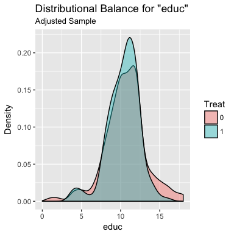
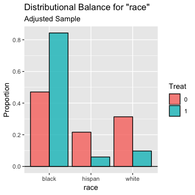

<!-- README.md is generated from README.Rmd. Please edit that file -->

# cobalt

[](https://cran.r-project.org/package=cobalt)
[](https://cran.r-project.org/package=cobalt)

Welcome to `cobalt`, which stands for **Co**variate **Bal**ance
**T**ables (and Plots). `cobalt` allows users to assess balance on
covariate distributions in preprocessed groups generated through
weighting, matching, or subclassification, such as by using the
propensity score. `cobalt`’s primary function is `bal.tab()`, which
stands for “balance table”, and essentially replaces (or supplements)
the balance assessment tools found in the R packages `twang`, `MatchIt`,
`CBPS`, and `Matching`. To examine how `bal.tab()` integrates with these
packages and others, see the help file for `bal.tab()` with `?bal.tab`,
which links to the methods used for each package. Each page has examples
of how `bal.tab()` is used with the package. There are also four
vignette detailing the use of `cobalt`, which can be accessed with
`browseVignettes("cobalt")`: one for basic uses of `cobalt`, one for the
use of `cobalt` with additional packages, one for the use of `cobalt`
with multiply imputed and/or clustered data, one for the use of `cobalt`
with longitudinal treatments. Currently, `cobalt` is compatible with
output from `MatchIt`, `twang`, `Matching`, `optmatch`, `CBPS`, `ebal`,
`WeightIt`, and `designmatch`, as well as data not processed through
these packages.

# Why cobalt?

Most of the major conditioning packages contain functions to assess
balance; so why use `cobalt` at all? `cobalt` arose out of several
desiderata when using these packages: to have standardized measures that
were consistent across all conditioning packages, to allow for
flexibility in the calculation and display of balance measures, and to
incorporate recent methodological recommendations in the assessment of
balance. In addition, `cobalt` has unique plotting capabilities that
make use of `ggplot2` in R for balance assessment and reporting.

Because conditioning methods are spread across several packages which
each have their idiosyncrasies in how they report balance (if at all),
comparing the resulting balance from various conditioning methods can be
a challenge. `cobalt` unites these packages by providing a single,
flexible tool that intelligently processes output from any of the
conditioning packages and provides the user with both useful defaults
and customizable options for display and calculation. `cobalt` also
allows for balance assessment on data not generated through any of the
conditioning packages. In addition, `cobalt` has tools for assessing and
reporting balance for clustered data sets, data sets generated through
multiple imputation, and data sets with a continuous treatment variable,
all features that exist in very limited capacities or not at all in
other packages.

A large focus in devloping `cobalt` was to streamline output so that
only the most useful, non-redundant, and complete information is
displayed, all at the user’s choice. Balance statistics are intuitive,
methodologically informed, and simple to interpret. Visual displays of
balance reflect the goals of balance assessment rather than being steps
removed. While other packages have focused their efforts on processing
data, `cobalt` only assesses balance, and does so particularly well.

New features are being added all the time, following the cutting edge of
methodolgocial work on balance assessment. As new packages and methods
are developed, `cobalt` will be ready to integrate them to further our
goal of simple, unified balance assessment.

Below are examples of `cobalt`’s primary functions:

``` r
library("cobalt")
library("MatchIt")
data("lalonde", package = "cobalt")

# Nearest neighbor matching with MatchIt
m.out <- matchit(treat ~ age + educ + race + married + nodegree + re74 + re75, 
    data = lalonde)

# Checking balance before and after matching:
bal.tab(m.out, m.threshold = 0.1, un = TRUE)
```

    #> Call
    #>  matchit(formula = treat ~ age + educ + race + married + nodegree + 
    #>     re74 + re75, data = lalonde)
    #> 
    #> Balance Measures
    #>                 Type Diff.Un Diff.Adj        M.Threshold
    #> distance    Distance  1.7941   0.9739                   
    #> age          Contin. -0.3094   0.0718     Balanced, <0.1
    #> educ         Contin.  0.0550  -0.1290 Not Balanced, >0.1
    #> race_black    Binary  0.6404   0.3730 Not Balanced, >0.1
    #> race_hispan   Binary -0.0827  -0.1568 Not Balanced, >0.1
    #> race_white    Binary -0.5577  -0.2162 Not Balanced, >0.1
    #> married       Binary -0.3236  -0.0216     Balanced, <0.1
    #> nodegree      Binary  0.1114   0.0703     Balanced, <0.1
    #> re74         Contin. -0.7211  -0.0505     Balanced, <0.1
    #> re75         Contin. -0.2903  -0.0257     Balanced, <0.1
    #> 
    #> Balance tally for mean differences
    #>                    count
    #> Balanced, <0.1         5
    #> Not Balanced, >0.1     4
    #> 
    #> Variable with the greatest mean difference
    #>    Variable Diff.Adj        M.Threshold
    #>  race_black    0.373 Not Balanced, >0.1
    #> 
    #> Sample sizes
    #>           Control Treated
    #> All           429     185
    #> Matched       185     185
    #> Unmatched     244       0

``` r
# Examining distributional balance with plots:
bal.plot(m.out, var.name = "educ")
bal.plot(m.out, var.name = "distance", mirror = TRUE, type = "histogram")
```




``` r
# Generating a Love plot to report balance:
love.plot(bal.tab(m.out), threshold = 0.1, abs = TRUE, var.order = "unadjusted")
```


Please remember to cite this package when using it to analyze data. For
example, in a manuscript, write: “Matching was performed using Matching
(Sekhon, 2011), and covariate balance was assessed using cobalt
(Greifer, 2018) in R (R Core team, 2018).” Use `citation("cobalt")` to
generate a bibliographic reference for the `cobalt` package.
