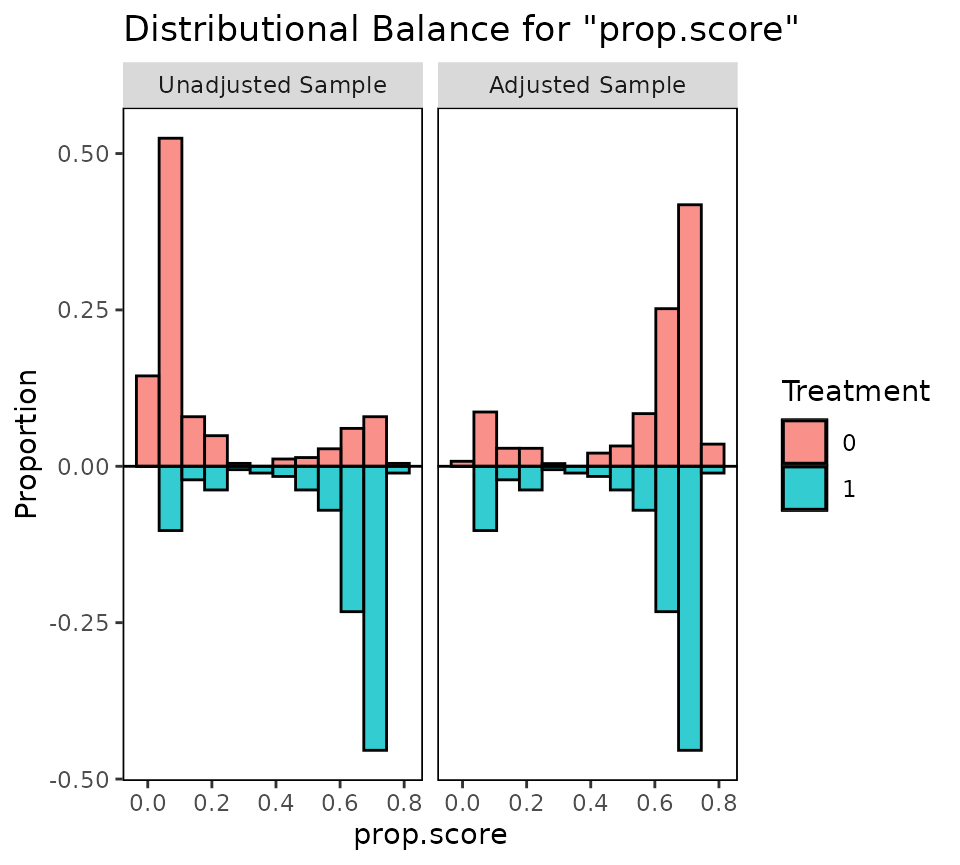
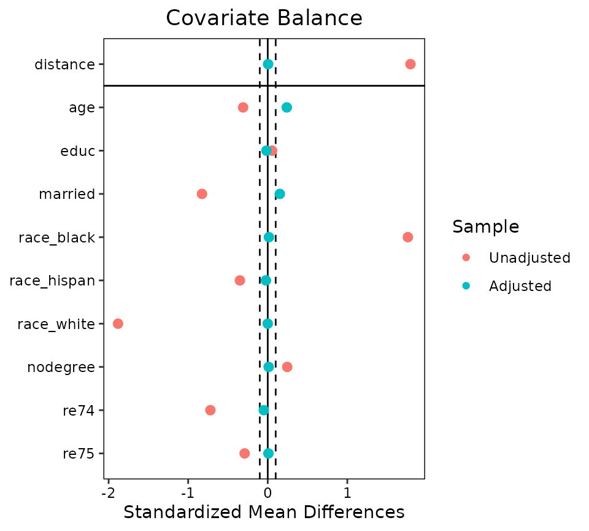
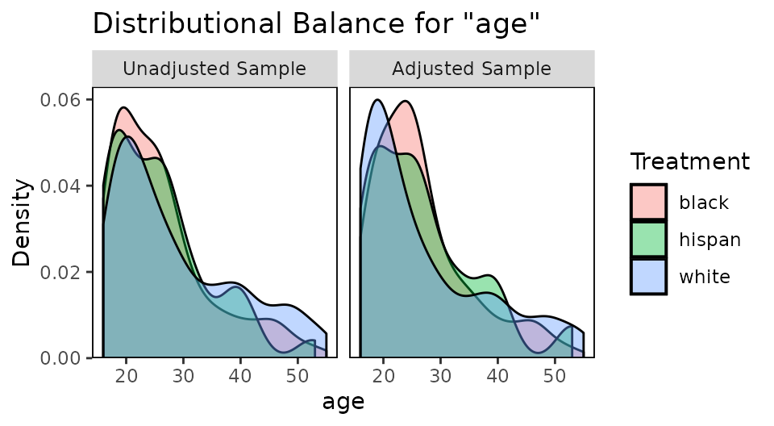
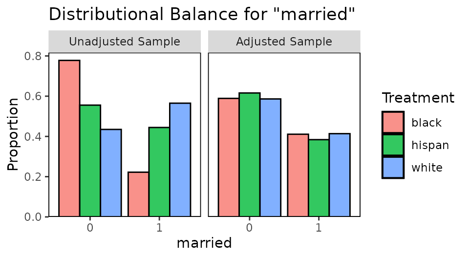
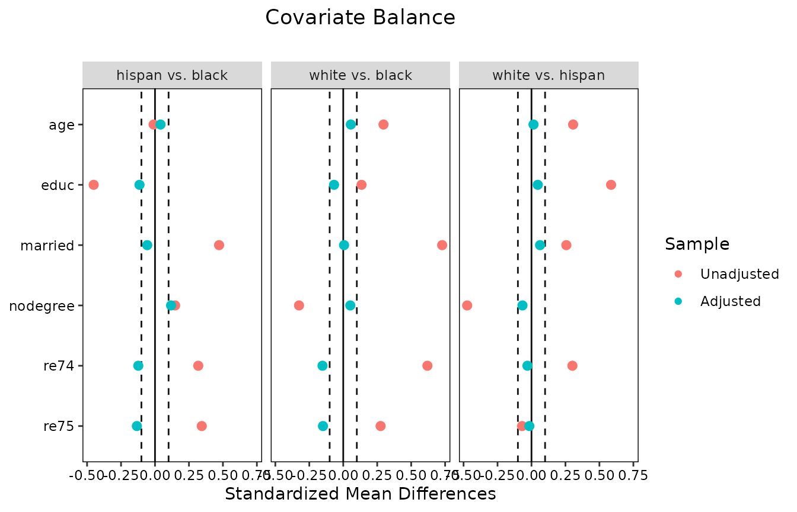
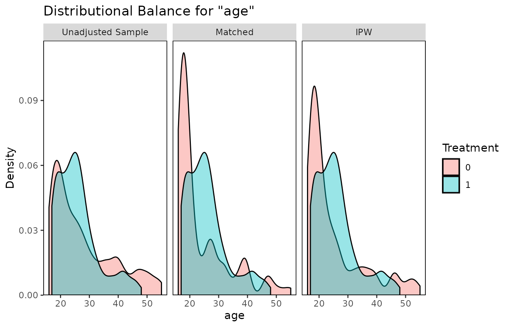

# Covariate Balance Tables and Plots: A Guide to the \*cobalt\* Package

This is an introductory guide for the use of *cobalt* in most common
scenarios. Several appendices are available for its use with more
complicated data scenarios and packages not demonstrated here.[¹](#fn1)

## Introduction

Preprocessing data through matching, weighting, or subclassification can
be an effective way to reduce model dependence and improve efficiency
when estimating the causal effect of a treatment ([Ho et al.
2007](#ref-hoMatchingNonparametricPreprocessing2007)). Propensity scores
and other related methods (e.g., coarsened exact matching, Mahalanobis
distance matching, genetic matching) have become popular in the social
and health sciences as tools for this purpose. Two excellent
introductions to propensity scores and other preprocessing methods are
Stuart ([2010](#ref-stuartMatchingMethodsCausal2010)) and Austin
([2011](#ref-austinIntroductionPropensityScore2011)), which describe
them simply and clearly and point to other sources of knowledge. The
logic and theory behind preprocessing will not be discussed here, and
reader’s knowledge of the causal assumption of strong ignorability is
assumed.

Several packages in R exist to perform preprocessing and causal effect
estimation, and some were reviewed by Keller and Tipton
([2016](#ref-kellerPropensityScoreAnalysis2016)). These include
*MatchIt* ([Ho et al. 2011](#ref-JSSv042i08)), *twang* ([Ridgeway et al.
2016](#ref-ridgewayToolkitWeightingAnalysis2016)), *Matching* ([Sekhon
2011](#ref-sekhonMultivariatePropensityScore2011)), *optmatch* ([Hansen
and Klopfer 2006](#ref-hansenOptimalFullMatching2006)), *CBPS* ([Fong et
al. 2019](#ref-fongCBPSCovariateBalancing2019)), *ebal* ([Hainmueller
2014](#ref-hainmuellerEbalEntropyReweighting2014)), *sbw* ([Zubizarreta,
Li, and Kim 2021](#ref-zubizarretaSbwStableBalancing2021)),
*designmatch* ([Zubizarreta, Kilcioglu, and Vielma
2018](#ref-zubizarretaDesignmatchMatchedSamples2018)), *WeightIt*
([Greifer 2021](#ref-greiferWeightItWeightingCovariate2021)),
*MatchThem* ([Pishgar et al.
2021](#ref-pishgarMatchThemMatchingWeighting2021)), and *cem* ([Iacus,
King, and Porro 2009](#ref-iacusCemSoftwareCoarsened2009)); these
together provide a near complete set of preprocessing tools in R to
date.

The following are the basic steps in performing a causal analysis using
data preprocessing ([Stuart
2010](#ref-stuartMatchingMethodsCausal2010)):

1.  Decide on covariates for which balance must be achieved
2.  Estimate the distance measure (e.g., propensity score)
3.  Condition on the distance measure (e.g., using matching, weighting,
    or subclassification)
4.  Assess balance on the covariates of interest; if poor, repeat steps
    2-4
5.  Estimate the treatment effect in the conditioned sample

Steps 2, 3, and 4 are accomplished by all of the packages mentioned
above. However, Step 4, assessing balance, is often overlooked in
propensity score applications, with researchers failing to report the
degree of covariate balance achieved by their conditioning ([Thoemmes
and Kim 2011](#ref-thoemmesSystematicReviewPropensity2011)). Achieving
balance is the very purpose of preprocessing because covariate balance
is what justifies ignorability on the observed covariates, allowing for
the potential for a valid causal inference after effect estimation ([Ho
et al. 2007](#ref-hoMatchingNonparametricPreprocessing2007)).

In addition to simply achieving balance, researchers must also report
balance to convince readers that their analysis was performed adequately
and that their causal conclusions are valid ([Thoemmes and Kim
2011](#ref-thoemmesSystematicReviewPropensity2011)). Covariate balance
is typically assessed and reported by using statistical measures,
including standardized mean differences, variance ratios, and t-test or
Kolmogorov-Smirnov-test p-values. Balance can be reported in an article
by means of balance tables or plots displaying the balance measures
before and after conditioning. If a defensible measure of balance is
used and presented, readers are empowered to judge for themselves
whether the causal claim made is valid or not based on the methods used
and covariates chosen.

*cobalt* is meant to supplement or replace the balance assessment tools
in the above packages and allow researchers to assess and report balance
on covariates simply, clearly, and flexibly before and after
conditioning. It integrates seamlessly with the above packages so that
users can employ both the conditioning package of their choice and
*cobalt* in conjunction to assess and report balance. It is important to
note that *cobalt* does not replace the highly sophisticated
*conditioning* tools of these packages, as it does no conditioning or
estimation of its own.

The rest of this guide explains how to use *cobalt* with some of the
above packages and others, as well as the choices instituted by the
functions and customizable by the user. Other vignettes describe the use
of *cobalt* with packages not mentioned here, with multiply imputed and
clustered data, and with longitudinal treatments.

#### Citing *cobalt*

When using *cobalt*, please cite your use of it along with the
conditioning package used. For example, if you use *Matching* for
propensity score estimation and matching and *cobalt* for balance
assessment and/or reporting, a possible citation might go as follows:

> Matching was performed using the Matching package (Sekhon, 2011), and
> covariate balance was assessed using cobalt (Greifer, 2026), both in R
> (R Core Team, 2025).

Use `citation("cobalt")` to generate the correct citation for *cobalt*.

## Why *cobalt*?

If most of the major conditioning packages contain functions to assess
balance, why use *cobalt* at all? *cobalt* arose out of several
desiderata when using these packages: to have standardized measures that
were consistent across all conditioning packages, to allow for
flexibility in the calculation and display of balance measures, and to
incorporate recent methodological recommendations in the assessment of
balance. However, some users of these packages may be completely
satisfied with their capabilities and comfortable with their output; for
them, *cobalt* still has value in its unique plotting capabilities that
make use of *ggplot2* in R.

The following are some reasons why *cobalt* may be attractive to users
of *MatchIt*, *twang*, *Matching*, *optmatch*, *CBPS*, *ebal*, *sbw*,
*designmatch*, *WeightIt*, and other conditioning packages:

#### Visual clarity

*cobalt* presents one table in its balance output, and it contains all
the information required to assess balance. *twang* and *CBPS* present
two tables, *MatchIt* presents three tables, and *Matching* presents as
many tables as there are covariates. Although each of these tables
contains valuable information, the
[`bal.tab()`](https://ngreifer.github.io/cobalt/reference/bal.tab.md)
function in *cobalt* allows for a quick and easy search for the
information desired, which is often a single column containing a balance
statistic (such as the standardized mean difference) for the adjusted
sample.

#### Useful summaries

Although a thorough balance assessment requires examining the balance of
each covariate individually, *cobalt*’s
[`bal.tab()`](https://ngreifer.github.io/cobalt/reference/bal.tab.md)
function can also produce quick balance summaries that can aid in model
selection when there are many covariates or higher order terms to
examine. These summaries include the proportion of covariates that have
met a user-specified threshold for balance and the covariate with the
highest degree of imbalance, two values that have been shown to be
effective in diagnosing imbalance and potential bias ([Stuart, Lee, and
Leacy 2013](#ref-stuartPrognosticScorebasedBalance2013)).

#### One tool to rule them all

Because there is no *a priori* way to know which conditioning method
will work best for a given sample, users should try several methods, and
these methods are spread across various packages; for example, full
matching is available only in *MatchIt* and *optmatch*, generalized
boosted modeling only in *twang*, covariate balancing propensity score
weighting only in *CBPS*, genetic matching only in *MatchIt* and
*Matching*, and entropy balancing only in *ebal*[²](#fn2). If a user
wants to compare these methods on their ability to generate balance in
the sample, they cannot do so on the same metrics and with the same
output. Each package computes balance statistics differently (if at
all), and the relevant balance measures are in different places in each
package. By using *cobalt* to assess balance across packages, users can
be sure they are using a single, equivalent balance metric across
methods, and the relevant balance statistics will be in the same place
and computed the same way regardless of the conditioning package used.

#### Flexibility

*cobalt* gives users choice in which statistics are presented and how
they are calculated, but intelligently uses defaults that are in line
with the goals of unified balance assessment and with the data
available. Rather than displaying all values calculated,
[`bal.tab()`](https://ngreifer.github.io/cobalt/reference/bal.tab.md)
only displays what the user wants; at a bare minimum, the standardized
mean difference for each covariate is displayed, which is traditionally
considered sufficient for model selection and justification in
preprocessing analysis for binary treatments. Even if the user doesn’t
want other values displayed, they are all still calculated, and thus
available for use in programming (though this can be disabled for
increased speed).

#### Pretty plots

The main conditioning packages produce plots that can be useful in
assessing balance, summarizing balance, and understanding the
intricacies of the conditioning method for which simple text would be
insufficient. Many of these plots are unique to each package, and
*cobalt* has not attempted to replace or replicate them. For other
plots, though, *cobalt* uses *ggplot2* to present clean, clear,
customizable, and high-quality displays for balance assessment and
presentation. The two included plotting functions are
[`bal.plot()`](https://ngreifer.github.io/cobalt/reference/bal.plot.md),
which generates plots of the distributions of covariates and treatment
levels so that more complete distributional balance can be assessed
beyond numerical summaries, and
[`love.plot()`](https://ngreifer.github.io/cobalt/reference/love.plot.md),
which generates a plot summarizing covariate balance before and after
conditioning, popularized by Dr. Thomas E. Love. Because these plots use
*ggplot2* as their base, users familiar with *ggplot2* can customize
various elements of the plots for use in publications or presentations.

#### Unique features

There are unique features in *cobalt* that do not exist in any other
package. These include the handling of clustered and grouped data and
the handling of data generated with multiple imputation. These more
advanced uses of *cobalt* are described in detail in
[`vignette("segmented-data")`](https://ngreifer.github.io/cobalt/articles/segmented-data.md).
In addition, *cobalt* includes tools for handling data sets with
continuous and multi-category treatments. Data sets with longitudinal
treatments, where time-varying confounding may be an issue, can be
handled as well; these uses are described in
[`vignette("longitudinal-treat")`](https://ngreifer.github.io/cobalt/articles/longitudinal-treat.md).

## How To Use cobalt

There are three main functions for use in *cobalt*:
[`bal.tab()`](https://ngreifer.github.io/cobalt/reference/bal.tab.md),
[`bal.plot()`](https://ngreifer.github.io/cobalt/reference/bal.plot.md),
and
[`love.plot()`](https://ngreifer.github.io/cobalt/reference/love.plot.md).
There are also several utility functions which can be used to ease the
use of *cobalt* and other packages. The next sections describe how to
use each, complete with example code and output. To start, install and
load *cobalt* with the following code:

``` r
install.packages("cobalt")
library("cobalt")
```

### Utilities

In addition to its main functions, *cobalt* contains several utility
functions, which include
[`f.build()`](https://ngreifer.github.io/cobalt/reference/f.build.md),
[`splitfactor()`](https://ngreifer.github.io/cobalt/reference/splitfactor.md)
and
[`unsplitfactor()`](https://ngreifer.github.io/cobalt/reference/splitfactor.md),
[`get.w()`](https://ngreifer.github.io/cobalt/reference/get.w.md), and
[`bal.init()`](https://ngreifer.github.io/cobalt/reference/bal.compute.md)
and
[`bal.compute()`](https://ngreifer.github.io/cobalt/reference/bal.compute.md).
These are meant to reduce the typing and programming burden that often
accompany the use of R with a diverse set of packages. To simplify this
vignette, descriptions of these functions are in
[`vignette("other-packages")`](https://ngreifer.github.io/cobalt/articles/other-packages.md).

### `bal.tab()`

[`bal.tab()`](https://ngreifer.github.io/cobalt/reference/bal.tab.md) is
the primary function of *cobalt*. It produces balance tables for the
objects given as inputs. The balance tables can be customized with a
variety of inputs, which affect both calculation and presentation of
values. It performs similar functions to
[`summary()`](https://rdrr.io/r/base/summary.html) in *MatchIt*;
[`bal.table()`](https://rdrr.io/pkg/twang/man/bal.table.html),
[`summary()`](https://rdrr.io/r/base/summary.html), and
[`dx.wts()`](https://rdrr.io/pkg/twang/man/dx.wts.html) in *twang*;
[`MatchBalance()`](https://rdrr.io/pkg/Matching/man/MatchBalance.html)
and [`summary()`](https://rdrr.io/r/base/summary.html) in *Matching*;
[`balance()`](https://rdrr.io/pkg/CBPS/man/balance.html) in *CBPS*; and
[`summarize()`](https://rdrr.io/pkg/sbw/man/summarize.html) in *sbw*. It
can be seen as a replacement or a supplement to these functions.

For more help using
[`bal.tab()`](https://ngreifer.github.io/cobalt/reference/bal.tab.md),
see [`?bal.tab`](https://ngreifer.github.io/cobalt/reference/bal.tab.md)
in R, which contains information on how certain values are calculated
and links to the help files for the
[`bal.tab()`](https://ngreifer.github.io/cobalt/reference/bal.tab.md)
methods that integrate with the above packages.

For simplicity, the description of the use of
[`bal.tab()`](https://ngreifer.github.io/cobalt/reference/bal.tab.md)
will be most complete in its use without any other package. The
demonstration will display
[`bal.tab()`](https://ngreifer.github.io/cobalt/reference/bal.tab.md)’s
many options, several of which differ based on with which package, if
any,
[`bal.tab()`](https://ngreifer.github.io/cobalt/reference/bal.tab.md) is
used. The other demonstrations will be minimal, highlighting how to use
[`bal.tab()`](https://ngreifer.github.io/cobalt/reference/bal.tab.md)
effectively with *MatchIt* and *WeightIt*, but not detailing all its
possible options with these packages, to avoid redundancy. The use of
[`bal.tab()`](https://ngreifer.github.io/cobalt/reference/bal.tab.md)
with other packages is described in
[`vignette("other-packages")`](https://ngreifer.github.io/cobalt/articles/other-packages.md).

#### Using `bal.tab()` on its own

[`bal.tab()`](https://ngreifer.github.io/cobalt/reference/bal.tab.md)
can take in any data set and set of weights, subclasses, or matching
strata and evaluate balance on them. This can be useful if propensity
score weights, subclasses, or matching strata were generated outside of
the supported packages, if balance assessment is desired prior to
adjustment, or if package output is adjusted in such a way as to make it
unusable with one of
[`bal.tab()`](https://ngreifer.github.io/cobalt/reference/bal.tab.md)’s
other methods (e.g., if cases were manually removed or weights manually
changed). In *twang*, the function
[`dx.wts()`](https://rdrr.io/pkg/twang/man/dx.wts.html) performs a
similar action by allowing for the balance assessment of groups weighted
not using *twang* functions, though it is more limited in the types of
data or conditioning strategies allowed. Below is an example of the use
of [`bal.tab()`](https://ngreifer.github.io/cobalt/reference/bal.tab.md)
with ATT weights generating using logistic regression for a
weighting-by-the-odds analysis:

``` r
data("lalonde", package = "cobalt") #If not yet loaded
covs <- subset(lalonde, select = -c(treat, re78, nodegree, married))

# Generating ATT weights as specified in Austin (2011)
lalonde$p.score <- glm(treat ~ age + educ + race + re74 + re75,
                       data = lalonde,
                       family = "binomial")$fitted.values
lalonde$att.weights <- with(lalonde, treat + (1 - treat) * p.score / (1 - p.score))

bal.tab(covs, treat = lalonde$treat, weights = lalonde$att.weights)
```

    ## Balance Measures
    ##                Type Diff.Adj
    ## age         Contin.   0.1112
    ## educ        Contin.  -0.0641
    ## race_black   Binary  -0.0044
    ## race_hispan  Binary   0.0016
    ## race_white   Binary   0.0028
    ## re74        Contin.  -0.0039
    ## re75        Contin.  -0.0428
    ## 
    ## Effective sample sizes
    ##            Control Treated
    ## Unadjusted   429.      185
    ## Adjusted     108.2     185

Displayed first is the balance table, and last is a summary of sample
size information. Because weighting was specified as the method used,
effective sample sizes are given. See
[`?bal.tab`](https://ngreifer.github.io/cobalt/reference/bal.tab.md), or
“Details on Calculations” below for details on this calculation.

There are several ways to specify input to
[`bal.tab()`](https://ngreifer.github.io/cobalt/reference/bal.tab.md)
when using data outside a conditioning package. The first, as shown
above, is to use a data frame of covariates and vectors for treatment
status and weights or subclasses. The user can additionally specify a
vector of distance measures (e.g., propensity scores) if balance is to
be assessed on those as well. If `weights` is left empty, balance on the
unadjusted sample will be reported. The user can also optionally specify
a data set to the `data` argument; this makes it so that the arguments
to `treat`, `weights`, `distance`, `subclass`, and others can be
specified either with a vector or with the name of a variable in the
argument to `data` that contains the respective values.

Another way to specify input to
[`bal.tab()`](https://ngreifer.github.io/cobalt/reference/bal.tab.md) is
to use the formula interface. Below is an example of its use:

``` r
bal.tab(treat ~ covs, data = lalonde,
        weights = "att.weights",
        distance = "p.score")
```

    ## Balance Measures
    ##                 Type Diff.Adj
    ## p.score     Distance  -0.0397
    ## age          Contin.   0.1112
    ## educ         Contin.  -0.0641
    ## race_black    Binary  -0.0044
    ## race_hispan   Binary   0.0016
    ## race_white    Binary   0.0028
    ## re74         Contin.  -0.0039
    ## re75         Contin.  -0.0428
    ## 
    ## Effective sample sizes
    ##            Control Treated
    ## Unadjusted   429.      185
    ## Adjusted     108.2     185

To use the formula interface, the user must specify a formula relating
treatment to the covariates for which balance is to be assessed. If any
of these variables exist in a data set, it must be supplied to `data`.
Here, the `covs` data frame was used for simplicity, but using
[`f.build()`](https://ngreifer.github.io/cobalt/reference/f.build.md) or
the traditional formula input of `treat ~ v1 + v2 + v3 + ...` is also
acceptable. As above, the arguments to `weights`, `distance`,
`subclass`, and others can be specified either as vectors or data frames
containing the values or as names of the variables in the argument to
`data` containing the values. In the above example, an argument to
`distance` was specified, and balance measures for the propensity score
now appear in the balance table.

By default,
[`bal.tab()`](https://ngreifer.github.io/cobalt/reference/bal.tab.md)
outputs standardized mean differences for continuous variables and raw
differences in proportion for binary variables. For more details on how
these values are computed and determined, see
[`?bal.tab`](https://ngreifer.github.io/cobalt/reference/bal.tab.md) or
“Details on Calculations” below. To see raw or standardized mean
differences for binary or continuous variables, you can manually set
`binary` and/or `continuous` to `"raw"` or `"std"`. These can also be
set as global options by using, for example,
`set.cobalt.options(binary = "std")`, which allows the user not to type
a non-default option every time they call `bal.tab`.

``` r
bal.tab(treat ~ covs, data = lalonde,
        weights = "att.weights",
        binary = "std", continuous = "std")
```

    ## Balance Measures
    ##                Type Diff.Adj
    ## age         Contin.   0.1112
    ## educ        Contin.  -0.0641
    ## race_black   Binary  -0.0120
    ## race_hispan  Binary   0.0068
    ## race_white   Binary   0.0093
    ## re74        Contin.  -0.0039
    ## re75        Contin.  -0.0428
    ## 
    ## Effective sample sizes
    ##            Control Treated
    ## Unadjusted   429.      185
    ## Adjusted     108.2     185

Users can specify additional variables for which to display balance
using the argument to `addl`, which can be supplied as a data.frame, a
formula containing variables, or a string of names of variables. Users
can also add all two-way interactions between covariates, including
those in `addl`, by specifying `int = TRUE`, and can add polynomials
(e.g., squares) of covariates by specifying a numeric argument to
`poly`. Interactions will not be computed for the distance measure
(i.e., the propensity score), and squared terms will not be computed for
binary variables. For more details on interactions, see “Details on
Calculations”, below. To only request a few desired interaction terms,
these can be entered into `addl` using a formula, as in
`addl = ~ V1 * V2`. Below, balance is requested on the variables stored
in `covs`, the additional variables `nodegree` and `married`, and their
interactions and squares.

``` r
# Balance on all covariates in data set, including interactions and squares
bal.tab(treat ~ covs, data = lalonde,
        weights = "att.weights",
        addl = ~ nodegree + married,
        int = TRUE, poly = 2)
```

    ## Balance Measures
    ##                             Type Diff.Adj
    ## age                      Contin.   0.1112
    ## educ                     Contin.  -0.0641
    ## race_black                Binary  -0.0044
    ## race_hispan               Binary   0.0016
    ## race_white                Binary   0.0028
    ## re74                     Contin.  -0.0039
    ## re75                     Contin.  -0.0428
    ## nodegree                  Binary   0.1151
    ## married                   Binary  -0.0938
    ## age²                     Contin.  -0.0194
    ## educ²                    Contin.  -0.1353
    ## re74²                    Contin.   0.0675
    ## re75²                    Contin.   0.0196
    ## age * educ               Contin.   0.0950
    ## age * race_black         Contin.   0.0741
    ## age * race_hispan        Contin.  -0.0096
    ## age * race_white         Contin.  -0.0013
    ## age * re74               Contin.  -0.0498
    ## age * re75               Contin.  -0.0144
    ## age * nodegree_0         Contin.  -0.1950
    ## age * nodegree_1         Contin.   0.2507
    ## age * married_0          Contin.   0.3612
    ## age * married_1          Contin.  -0.2843
    ## educ * race_black        Contin.  -0.0441
    ## educ * race_hispan       Contin.   0.0122
    ## educ * race_white        Contin.   0.0085
    ## educ * re74              Contin.  -0.0149
    ## educ * re75              Contin.  -0.0834
    ## educ * nodegree_0        Contin.  -0.2655
    ## educ * nodegree_1        Contin.   0.3051
    ## educ * married_0         Contin.   0.2016
    ## educ * married_1         Contin.  -0.2453
    ## race_black * re74        Contin.   0.0477
    ## race_black * re75        Contin.  -0.0297
    ## race_black * nodegree_0   Binary  -0.1110
    ## race_black * nodegree_1   Binary   0.1067
    ## race_black * married_0    Binary   0.0535
    ## race_black * married_1    Binary  -0.0579
    ## race_hispan * re74       Contin.  -0.0129
    ## race_hispan * re75       Contin.   0.0258
    ## race_hispan * nodegree_0  Binary  -0.0068
    ## race_hispan * nodegree_1  Binary   0.0084
    ## race_hispan * married_0   Binary   0.0076
    ## race_hispan * married_1   Binary  -0.0060
    ## race_white * re74        Contin.  -0.2488
    ## race_white * re75        Contin.  -0.0926
    ## race_white * nodegree_0   Binary   0.0027
    ## race_white * nodegree_1   Binary   0.0001
    ## race_white * married_0    Binary   0.0327
    ## race_white * married_1    Binary  -0.0300
    ## re74 * re75              Contin.   0.0636
    ## re74 * nodegree_0        Contin.  -0.0464
    ## re74 * nodegree_1        Contin.   0.0467
    ## re74 * married_0         Contin.   0.1108
    ## re74 * married_1         Contin.  -0.1122
    ## re75 * nodegree_0        Contin.  -0.3656
    ## re75 * nodegree_1        Contin.   0.1487
    ## re75 * married_0         Contin.   0.1093
    ## re75 * married_1         Contin.  -0.1177
    ## nodegree_0 * married_0    Binary  -0.0134
    ## nodegree_0 * married_1    Binary  -0.1017
    ## nodegree_1 * married_0    Binary   0.1072
    ## nodegree_1 * married_1    Binary   0.0079
    ## 
    ## Effective sample sizes
    ##            Control Treated
    ## Unadjusted   429.      185
    ## Adjusted     108.2     185

Standardized mean differences can be computed several ways, and the user
can decide how
[`bal.tab()`](https://ngreifer.github.io/cobalt/reference/bal.tab.md)
does so using the argument to `s.d.denom`, which controls whether the
measure of spread in the denominator is the standard deviation of the
treated group (`"treated"`), most appropriate when computing the ATT;
the standard deviation of the control group (`"control"`), most
appropriate when computing the ATC; the pooled standard deviation
(`"pooled"`), computed as in Austin ([2009](#ref-austin2009)), most
appropriate when computing the ATE; or another value (see
[`?col_w_smd`](https://ngreifer.github.io/cobalt/reference/balance-summary.md)
for more options).
[`bal.tab()`](https://ngreifer.github.io/cobalt/reference/bal.tab.md)
can generally determine if the ATT or ATC are being estimated and will
supply `s.d.denom` accordingly. Otherwise, the default is `"pooled"`.

The next options only affect display, not the calculation of any
statistics. First is `disp`, which controls whether sample statistics
for each covariate in each group are displayed. Options include
`"means"` and `"sds"`, which will request group means and standard
deviations, respectively[³](#fn3).

Next is `stats`, which controls which balance statistics are displayed.
For binary and multi-category treatments, options include `"mean.diffs"`
for (standardized) mean differences, `"variance.ratios"` for variance
ratios, `"ks.statistics"` for Kolmogorov-Smirnov (KS) statistics, and
`"ovl.coefficients"` for the complement of the overlapping coefficient
(abbreviations are allowed). See
[`help("balance-statistics")`](https://ngreifer.github.io/cobalt/reference/balance-statistics.md)
for details. By default, standardized mean differences are displayed.
Variance ratios are another important tool for assessing balance beyond
mean differences because they pertain to the shape of the covariate
distributions beyond their centers. Variance ratios close to 1 (i.e.,
equal variances in both groups) are indicative of group balance ([Austin
2009](#ref-austin2009)). KS statistics measure the greatest distance
between the empirical cumulative distribution functions (eCDFs) for each
variable between two groups. The statistic is bounded at 0 and 1, with 0
indicting perfectly identical distributions and 1 indicating perfect
separation between the distributions (i.e., no overlap at all); values
close to 0 are thus indicative of balance. The use of the KS statistic
to formally assess balance is debated. Austin and Stuart
([2015](#ref-austinMovingBestPractice2015)) recommend its use, and it or
a variant appears as a default balance statistic in *MatchIt*, *twang*,
and *Matching*. On the other hand, Belitser et al.
([2011](#ref-belitserMeasuringBalanceModel2011)), Stuart, Lee, and Leacy
([2013](#ref-stuartPrognosticScorebasedBalance2013)), and Ali et al.
([2014](#ref-aliPropensityScoreBalance2014)) all found that global
balance assessments using the KS statistic performed uniformly worse
than standardized mean differences, especially at sample sizes less than
1000 in their simulations. The overlapping coefficient measures the
amount of overlap in the covariate distributions between two groups. As
in Franklin et al. ([2014](#ref-franklinMetricsCovariateBalance2014)),
the complement is used so that 0 indicates perfectly overlapping
distributions and 1 indicates perfectly non-overlapping distributions.
The overlapping coefficient complement functions similarly to the KS
statistic in that it summarizes imbalance across the whole distribution
of the covariate, not just its mean or variance, but avoids some of the
weaknesses of the KS statistic.

Next is `un`, which controls whether the statistics to be displayed
should be displayed for the unadjusted group as well. This can be useful
the first time balance is assessed to see the initial group imbalance.
Setting `un = FALSE`, which is the default, can de-clutter the output to
maintain the spotlight on the group balance after adjustment.

``` r
# Balance tables with mean differences, variance ratios, and 
#  statistics for the unadjusted sample
bal.tab(treat ~ covs, data = lalonde,
        weights = "att.weights",
        disp = c("means", "sds"), un = TRUE, 
        stats = c("mean.diffs", "variance.ratios"))
```

    ## Balance Measures
    ##                Type    M.0.Un   SD.0.Un    M.1.Un   SD.1.Un Diff.Un V.Ratio.Un
    ## age         Contin.   28.0303   10.7867   25.8162    7.1550 -0.3094     0.4400
    ## educ        Contin.   10.2354    2.8552   10.3459    2.0107  0.0550     0.4959
    ## race_black   Binary    0.2028         .    0.8432         .  0.6404          .
    ## race_hispan  Binary    0.1422         .    0.0595         . -0.0827          .
    ## race_white   Binary    0.6550         .    0.0973         . -0.5577          .
    ## re74        Contin. 5619.2365 6788.7508 2095.5737 4886.6204 -0.7211     0.5181
    ## re75        Contin. 2466.4844 3291.9962 1532.0553 3219.2509 -0.2903     0.9563
    ##               M.0.Adj  SD.0.Adj   M.1.Adj  SD.1.Adj Diff.Adj V.Ratio.Adj
    ## age           25.0205   10.0330   25.8162    7.1550   0.1112      0.5086
    ## educ          10.4748    2.5918   10.3459    2.0107  -0.0641      0.6018
    ## race_black     0.8476         .    0.8432         .  -0.0044           .
    ## race_hispan    0.0578         .    0.0595         .   0.0016           .
    ## race_white     0.0945         .    0.0973         .   0.0028           .
    ## re74        2114.5263 4013.9557 2095.5737 4886.6204  -0.0039      1.4821
    ## re75        1669.9618 2974.6678 1532.0553 3219.2509  -0.0428      1.1712
    ## 
    ## Effective sample sizes
    ##            Control Treated
    ## Unadjusted   429.      185
    ## Adjusted     108.2     185

See `?display_options` for the full list of display options. They can
also be set as global options by using
[`set.cobalt.options()`](https://ngreifer.github.io/cobalt/reference/set.cobalt.options.md).

Finally, the user can specify a threshold for balance statistics using
the `threshold` argument. Thresholds can be useful in determining
whether satisfactory balance has been achieved. For standardized mean
differences, thresholds of .1 and .25 have been proposed, but Stuart,
Lee, and Leacy ([2013](#ref-stuartPrognosticScorebasedBalance2013))
found that a threshold of .1 was more effective at assessing imbalance
that would lead to biased effect estimation. In general, standardized
mean differences should be as close to 0 as possible, but a conservative
upper limit such as .1 can be a valuable heuristic in selecting models
and defending the conditioning choice. The What Works Clearinghouse
Standards Handbook recommends standardized mean differences of less than
.05 (What Works Clearinghouse, 2020).

When thresholds are requested, a few components are added to the balance
output: an extra column in the balance table stating whether each
covariate is or is not balanced according to the threshold, an extra
table below the balance table with a tally of how many covariates are or
are not balanced according to the threshold, and a notice of which
covariate has the greatest imbalance after conditioning and whether it
exceeded the threshold. Below, thresholds are requested for mean
differences (`m`) and variance ratios (`v`).

``` r
# Balance tables with thresholds for mean differences and variance ratios
bal.tab(treat ~ covs, data = lalonde,
        weights = "att.weights",
        thresholds = c(m = .1, v = 2))
```

    ## Balance Measures
    ##                Type Diff.Adj        M.Threshold V.Ratio.Adj  V.Threshold
    ## age         Contin.   0.1112 Not Balanced, >0.1      0.5086 Balanced, <2
    ## educ        Contin.  -0.0641     Balanced, <0.1      0.6018 Balanced, <2
    ## race_black   Binary  -0.0044     Balanced, <0.1           .             
    ## race_hispan  Binary   0.0016     Balanced, <0.1           .             
    ## race_white   Binary   0.0028     Balanced, <0.1           .             
    ## re74        Contin.  -0.0039     Balanced, <0.1      1.4821 Balanced, <2
    ## re75        Contin.  -0.0428     Balanced, <0.1      1.1712 Balanced, <2
    ## 
    ## Balance tally for mean differences
    ##                    count
    ## Balanced, <0.1         6
    ## Not Balanced, >0.1     1
    ## 
    ## Variable with the greatest mean difference
    ##  Variable Diff.Adj        M.Threshold
    ##       age   0.1112 Not Balanced, >0.1
    ## 
    ## Balance tally for variance ratios
    ##                  count
    ## Balanced, <2         4
    ## Not Balanced, >2     0
    ## 
    ## Variable with the greatest variance ratio
    ##  Variable V.Ratio.Adj  V.Threshold
    ##       age      0.5086 Balanced, <2
    ## 
    ## Effective sample sizes
    ##            Control Treated
    ## Unadjusted   429.      185
    ## Adjusted     108.2     185

To simplify output when many covariates are included or when
`int = TRUE` is specified, `imbalanced.only` can be set to `TRUE`, which
will only reveal imbalanced covariates in the output. These are
covariates that have failed to meet any of the balance thresholds set.
In addition, `disp.bal.tab` can be set `FALSE`, which will hide the
balance table (revealing only the balance summaries accompanying the
threshold).

If sampling weights are used and are to be applied to both the adjusted
and unadjusted groups, they can be specified with an argument to
`s.weights`, which can be specified either by providing a vector of
sampling weights for each unit or by providing the name of a variable in
`data` containing the sampling weights. The adjusted and unadjusted
samples will each be weighted by the sampling weights by multiplying the
adjustment weights (if any) by the sampling weights.

It is possible to view balance for more than one set of weights at a
time. The input to `weights` should be either the names of variables in
`data` containing the desired weights or a named data frame containing
each set of weights. The arguments to `s.d.denom` or `estimand` must
have the same length as the number of sets of weights, or else be of
length 1, applying the sole input to all sets of weights. Below is an
example comparing the weights estimated above to a new set of weights.
Another example can be found in the section “Comparing Balancing
Methods”.

``` r
# Generating ATT weights with different covariates
lalonde$p.score2 <- glm(treat ~ age + I(age^2) + race + educ + re74, 
                        data = lalonde,
                        family = "binomial")$fitted.values
lalonde$att.weights2 <- with(lalonde, treat + (1 - treat) * p.score2 / (1 - p.score2))

bal.tab(treat ~ covs, data = lalonde,
        weights = c("att.weights", "att.weights2"),
        estimand = "ATT")
```

    ## Balance Measures
    ##                Type Diff.att.weights Diff.att.weights2
    ## age         Contin.           0.1112           -0.0400
    ## educ        Contin.          -0.0641           -0.0227
    ## race_black   Binary          -0.0044           -0.0005
    ## race_hispan  Binary           0.0016           -0.0010
    ## race_white   Binary           0.0028            0.0015
    ## re74        Contin.          -0.0039            0.0037
    ## re75        Contin.          -0.0428           -0.0083
    ## 
    ## Effective sample sizes
    ##              Control Treated
    ## All           429.       185
    ## att.weights   108.2      185
    ## att.weights2   72.04     185

When subclassification is used in conditioning, an argument to
`subclass` must be specified; this can be a vector of subclass
membership or the name of a variable in `data` containing subclass
membership.
[`bal.tab()`](https://ngreifer.github.io/cobalt/reference/bal.tab.md)
produces a different type of output from when matching or weighting are
used, though it has all of the same features. The default output is a
balance table displaying balance aggregated across subclasses; this can
be controlled with the `subclass.summary` options. Each cell contains
the average statistic across the subclasses. Using the arguments
discussed above will change the output as it does when only matching or
weighting is used.

To examine balance within each subclass, the user can specify
`which.subclass = .all`, which will produce output for the subclasses in
aggregate. Within subclasses, all the information above, including other
requested statistics, will be presented, except for statistics for the
unadjusted groups (since the adjustment occurs by creating the
subclasses), as specified by the user. See `?bal.tab.subclass` for more
details.

``` r
# Subclassification for ATT with 5 subclasses
lalonde$p.score <- glm(treat ~ age + educ + race + re74 + re75,
                       data = lalonde, 
                       family = "binomial")$fitted.values
nsub <- 5 #number of subclasses
lalonde$subclass <- with(lalonde,
                         findInterval(p.score, 
                                      quantile(p.score[treat == 1], 
                                               seq(0, 1, length.out = nsub + 1)), 
                                      all.inside = TRUE))
                         
bal.tab(treat ~ covs, data = lalonde,
        subclass = "subclass", 
        which.subclass = .all,
        subclass.summary = TRUE)
```

    ## Balance by subclass
    ##  - - - Subclass 1 - - - 
    ##                Type Diff.Adj
    ## age         Contin.  -0.4889
    ## educ        Contin.   0.1324
    ## race_black   Binary   0.1934
    ## race_hispan  Binary   0.1230
    ## race_white   Binary  -0.3164
    ## re74        Contin.  -0.2334
    ## re75        Contin.  -0.0435
    ## 
    ##  - - - Subclass 2 - - - 
    ##                Type Diff.Adj
    ## age         Contin.  -0.4423
    ## educ        Contin.   0.3102
    ## race_black   Binary   0.0000
    ## race_hispan  Binary   0.0000
    ## race_white   Binary   0.0000
    ## re74        Contin.   0.0584
    ## re75        Contin.   0.3445
    ## 
    ##  - - - Subclass 3 - - - 
    ##                Type Diff.Adj
    ## age         Contin.   0.4968
    ## educ        Contin.  -0.1031
    ## race_black   Binary   0.0000
    ## race_hispan  Binary   0.0000
    ## race_white   Binary   0.0000
    ## re74        Contin.  -0.1250
    ## re75        Contin.  -0.1912
    ## 
    ##  - - - Subclass 4 - - - 
    ##                Type Diff.Adj
    ## age         Contin.   0.2665
    ## educ        Contin.  -0.1616
    ## race_black   Binary   0.0000
    ## race_hispan  Binary   0.0000
    ## race_white   Binary   0.0000
    ## re74        Contin.  -0.1082
    ## re75        Contin.  -0.0307
    ## 
    ##  - - - Subclass 5 - - - 
    ##                Type Diff.Adj
    ## age         Contin.   0.2946
    ## educ        Contin.  -0.0757
    ## race_black   Binary   0.0000
    ## race_hispan  Binary   0.0000
    ## race_white   Binary   0.0000
    ## re74        Contin.  -0.0546
    ## re75        Contin.  -0.1770
    ## 
    ## Balance measures across subclasses
    ##                Type Diff.Adj
    ## age         Contin.   0.0216
    ## educ        Contin.   0.0195
    ## race_black   Binary   0.0387
    ## race_hispan  Binary   0.0246
    ## race_white   Binary  -0.0633
    ## re74        Contin.  -0.0923
    ## re75        Contin.  -0.0170
    ## 
    ## Sample sizes by subclass
    ##           1  2  3  4  5 All
    ## Control 350 25 21 14 19 429
    ## Treated  37 37 34 40 37 185
    ## Total   387 62 55 54 56 614

When using
[`bal.tab()`](https://ngreifer.github.io/cobalt/reference/bal.tab.md)
with continuous treatments, the default balance statistic presented is
the (weighted) Pearson correlation between each covariate and treatment.
Zhu, Coffman, and Ghosh
([2015](#ref-zhuBoostingAlgorithmEstimating2015)) recommend that
absolute correlations should be no greater than 0.1, but correlations
should ideally be as close to zero as possible. Spearman correlations
and distance correlations can also be requested. See the section “Using
*cobalt* with continuous treatments” and `?balance.stats` for more
details.

The next two sections describe the use of
[`bal.tab()`](https://ngreifer.github.io/cobalt/reference/bal.tab.md)
with the *MatchIt* and *WeightIt*. As stated above, the arguments
controlling calculations and display are largely the same across inputs
types, so they will not be described again except when their use differs
from that described in the present section.

#### Using `bal.tab()` with *MatchIt*

When using
[`bal.tab()`](https://ngreifer.github.io/cobalt/reference/bal.tab.md)
with *MatchIt*, fewer arguments need to be specified because information
is stored in the *MatchIt* object, the output of a call to
[`matchit()`](https://kosukeimai.github.io/MatchIt/reference/matchit.html).
[`bal.tab()`](https://ngreifer.github.io/cobalt/reference/bal.tab.md) is
used very similarly to
[`summary()`](https://rdrr.io/r/base/summary.html) in *MatchIt*: it
takes in a *MatchIt* object as its input, and prints a balance table
with the requested information. Below is a simple example of its use:

``` r
data("lalonde", package = "cobalt")

# Nearest neighbor 2:1 matching with replacement
m.out <- MatchIt::matchit(treat ~ age + educ + race + re74 + re75, 
                          data = lalonde, method = "nearest", 
                          ratio = 1, replace = TRUE)

bal.tab(m.out)
```

    ## Balance Measures
    ##                 Type Diff.Adj
    ## distance    Distance  -0.0010
    ## age          Contin.   0.1964
    ## educ         Contin.  -0.0726
    ## race_black    Binary   0.0108
    ## race_hispan   Binary  -0.0054
    ## race_white    Binary  -0.0054
    ## re74         Contin.   0.0667
    ## re75         Contin.   0.0936
    ## 
    ## Sample sizes
    ##                      Control Treated
    ## All                   429.       185
    ## Matched (ESS)          38.33     185
    ## Matched (Unweighted)   79.       185
    ## Unmatched             350.         0

The output looks very similar to *MatchIt*’s
[`summary()`](https://rdrr.io/r/base/summary.html) function: first is
the balance table, and second is a summary of the sample size before and
after adjustment.

Setting `binary = "std"` in
[`bal.tab()`](https://ngreifer.github.io/cobalt/reference/bal.tab.md)
will produce identical calculations to those in *MatchIt*’s
`summary(m.out)`, which produces standardized differences for binary
variables as well as continuous variables. The other arguments to
[`bal.tab()`](https://ngreifer.github.io/cobalt/reference/bal.tab.md)
when using it with *MatchIt* have the same form and function as those
given when using it without a conditioning package. The output when
using *MatchIt* for subclassification is the same as that displayed
previously.

#### Using `bal.tab()` with *WeightIt*

The *WeightIt* package provides functions and utilities for estimating
balancing weights and allows for the estimation of weights for binary,
multi-category, and categorical treatments and both point and
longitudinal treatments. It was designed to work seamlessly with
*cobalt*, so using it with *cobalt* is very straightforward. Below is a
simple example of using
[`bal.tab()`](https://ngreifer.github.io/cobalt/reference/bal.tab.md)
with *WeightIt*:

``` r
data("lalonde", package = "cobalt") #If not yet loaded

#Generating propensity score weights for the ATT
W.out <- WeightIt::weightit(treat ~ age + educ + race + re74 + re75,
                            data = lalonde,
                            method = "glm",
                            estimand = "ATT")

bal.tab(W.out)
```

    ## Balance Measures
    ##                 Type Diff.Adj
    ## prop.score  Distance  -0.0397
    ## age          Contin.   0.1112
    ## educ         Contin.  -0.0641
    ## race_black    Binary  -0.0044
    ## race_hispan   Binary   0.0016
    ## race_white    Binary   0.0028
    ## re74         Contin.  -0.0039
    ## re75         Contin.  -0.0428
    ## 
    ## Effective sample sizes
    ##            Control Treated
    ## Unadjusted   429.      185
    ## Adjusted     108.2     185

### `bal.plot()`

The gold standard for covariate balance is multidimensional independence
between treatment and covariates. Because this is hard to visualize and
assess with the large numbers of covariates typical of causal effect
analysis, univariate balance is typically assessed as a proxy. Most
conditioning packages, as well as *cobalt*, will provide numerical
summaries of balance, typically by comparing moments between the treated
and control groups. But even univariate balance is more complicated than
simple numerical summaries can address; examining distributional balance
is a more thorough method to assess balance between groups. Although
there are statistics such as the Kolmogorov-Smirnov statistic and the
overlapping coefficient complement that attempt to summarize
distributional balance beyond the first few moments ([Austin and Stuart
2015](#ref-austinMovingBestPractice2015); [Ali et al.
2015](#ref-aliReportingCovariateSelection2015)), complimenting
statistics with a visual examination of the distributional densities can
be an effective way of assessing distributional similarity between the
groups ([Ho et al.
2007](#ref-hoMatchingNonparametricPreprocessing2007)).

[`bal.plot()`](https://ngreifer.github.io/cobalt/reference/bal.plot.md)
allows users to do so by displaying density plots, histograms, empirical
CDF plots, bar graphs, and scatterplots so that users can visually
assess independence between treatment and covariates before and after
conditioning. Below is an example of the use of
[`bal.plot()`](https://ngreifer.github.io/cobalt/reference/bal.plot.md)
after using propensity score weighting for the ATT using the output from
*WeightIt* generated above.:

``` r
bal.plot(W.out, var.name = "age")
bal.plot(W.out, var.name = "race")
```


The first argument (or set of arguments) is the sufficient set of
arguments for a simple call to
[`bal.tab()`](https://ngreifer.github.io/cobalt/reference/bal.tab.md),
defining the data object (e.g., the output of a conditioning function),
the treatment indicators, and the weights or subclasses. See above for
examples. The next argument is the name of the covariate for which
distributional balance is to be assessed. If subclassification is used
(i.e., if subclasses are present in the input data object or arguments),
an additional argument `which.sub` can be specified, with a number
corresponding to the subclass number for which balance is to be assessed
on the specified covariate; if it is not specified, plots for all
subclasses will be displayed.

The user can also specify whether distributional balance is to be shown
before or after adjusting or both by using the argument to `which`. If
`which = "unadjusted"`, balance will be displayed for the unadjusted
sample only. If `which = "both"`, balance will be displayed for both the
unadjusted sample and the adjusted sample. The default is to display
balance for the adjusted sample.

The output of
[`bal.plot()`](https://ngreifer.github.io/cobalt/reference/bal.plot.md)
is a density plot, histogram, or empirical CDF plot for the two groups
on the given covariate, depending on the argument to `type`. For
categorical or binary variables, a bar graph is displayed instead. When
multi-category categorical variables are given, bars will be created for
each level, unlike in
[`bal.tab()`](https://ngreifer.github.io/cobalt/reference/bal.tab.md),
which splits the variable into several binary variables. The degree to
which the densities for the two groups overlap is a good measure of
group balance on the given covariate; significant differences in shape
can be indicative of poor balance, even when the mean differences and
variance ratios are well within thresholds. Strong distributional
similarity is especially important for variables strongly related to the
outcome of interest.

Distributional balance can also be assessed on the distance measure, and
this can form an alternative to other common support checks, like
*MatchIt*’s `plot(..., type = "hist")` or *twang*’s
`plot(..., plots = "boxplot")`. To examine the distributions of the
distance measure, the input to `var.name` must be the name of the
distance variable. If the data input object doesn’t already contain the
distance measure (e.g., if not using one of the conditioning packages),
the distance measure must be manually added as an input to
[`bal.plot()`](https://ngreifer.github.io/cobalt/reference/bal.plot.md)
through `distance`, in addition to being called through `var.name`.

Below is an example using
[`bal.plot()`](https://ngreifer.github.io/cobalt/reference/bal.plot.md)
to display the distributions of propensity scores before and after
weighting adjustment:

``` r
#Before and after weighting; which = "both"
bal.plot(W.out, var.name = "prop.score",
         which = "both",
         type = "histogram",
         mirror = TRUE)
```



Setting `type = "histogram"` produces a histogram rather than a density
plot, and setting `mirror = TRUE` creates a mirrored plot rather than
overlapping histograms. Mirroring only works with binary treatments.

It is generally not a useful assessment of balance to examine the
overlap of the distance measure distributions after adjustment, as most
conditioning methods will yield good distributional overlap on the
distance measure whether or not balance is achieved on the covariates
([Stuart, Lee, and Leacy
2013](#ref-stuartPrognosticScorebasedBalance2013)). However, it may be
useful to see the new range of the distance measure if calipers or
common support pruning are used.

The output plot is made using *ggplot2*, which means that users familiar
with *ggplot2* can adjust the plot with *ggplot2* commands.

When the treatment variable is continuous, users can use
[`bal.plot()`](https://ngreifer.github.io/cobalt/reference/bal.plot.md)
to examine and assess dependence between the covariate and treatment.
The arguments given to
[`bal.plot()`](https://ngreifer.github.io/cobalt/reference/bal.plot.md)
are the same as in the binary treatment case, but the resulting plots
are different. If the covariate is continuous, a scatterplot between the
covariate and the treatment variable will be displayed, along with a
linear fit line, a Loess curve, and a reference line indicating linear
independence. Used together, these lines can help diagnose departures
from independence beyond the simple correlation coefficient. Proximity
of the fit lines to the reference line is suggestive of independence
between the covariate and treatment variable. If the covariate is
categorical (including binary), density plots of the treatment variable
for each category will be displayed. Densities that overlap completely
are indicative of independence between the covariate and treatment. See
the section “Using cobalt with continuous treatments” for more details
and an example.

### `love.plot()`

The Love plot is a summary plot of covariate balance before and after
conditioning popularized by Dr. Thomas E. Love. In a visually appealing
and clear way, balance can be presented to demonstrate to readers that
balance has been met within a threshold, and that balance has improved
after conditioning \[which is not always the case; cf. King and Nielsen
([2019](#ref-kingWhyPropensityScores2019))\].
[`love.plot()`](https://ngreifer.github.io/cobalt/reference/love.plot.md)
does just this, providing the user with several options to customize
their plot for presentation. Below is an example of its use:

``` r
data("lalonde", package = "cobalt")

# Nearest neighbor 1:1 matching with replacement
m.out <- MatchIt::matchit(treat ~ age + educ + married + race +
                              nodegree + re74 + re75,
                          data = lalonde, 
                          method = "nearest",
                          replace = TRUE)

love.plot(m.out, binary = "std", thresholds = c(m = .1))
```



[`love.plot()`](https://ngreifer.github.io/cobalt/reference/love.plot.md)
takes as its arguments the same ones that would go into a call to
[`bal.tab()`](https://ngreifer.github.io/cobalt/reference/bal.tab.md).
In addition, it can take as its first argument the output of a call to
[`bal.tab()`](https://ngreifer.github.io/cobalt/reference/bal.tab.md);
this can be accomplished simply by inserting the
[`bal.tab()`](https://ngreifer.github.io/cobalt/reference/bal.tab.md)
call into the first argument or by saving the result of a call to
[`bal.tab()`](https://ngreifer.github.io/cobalt/reference/bal.tab.md) to
an object and inserting the object as the argument. There are several
other arguments, all of which control display, that are described below.

The output is a plot with the balance statistic on the X-axis and the
covariates output in
[`bal.tab()`](https://ngreifer.github.io/cobalt/reference/bal.tab.md) on
the Y-axis. Each point represents the balance statistic for that
covariate, colored based on whether it is calculated before or after
adjustment. The dotted lines represent the threshold set in the
`threshold` argument; if most or all of the points after adjustment are
within the threshold, that is good evidence that balance has been
achieved.

The default is to present the absolute mean differences as they are
calculated in the call to
[`bal.tab()`](https://ngreifer.github.io/cobalt/reference/bal.tab.md);
by specifying `stats = "variance.ratios"` or `stats = "ks.statistics"`
(abbreviations allowed), the user can request variance ratios or KS
statistics instead or in addition. Because binary variables don’t have
variance ratios calculated, there will not be rows for these variables,
but these rows can be added (with empty entries) to be in alignment with
mean differences by setting `drop.missing = FALSE`.

The `thresholds` argument works similarly to how it does in
[`bal.tab()`](https://ngreifer.github.io/cobalt/reference/bal.tab.md);
specifying it is optional, but doing so will provide an additional point
of reference on which to evaluate the displayed balance measures.

If mean difference are requested,
[`love.plot()`](https://ngreifer.github.io/cobalt/reference/love.plot.md)
will use the mean differences as they are calculated by
[`bal.tab()`](https://ngreifer.github.io/cobalt/reference/bal.tab.md)
and presented in the mean differences columns of the balance table. See
the section on using
[`bal.tab()`](https://ngreifer.github.io/cobalt/reference/bal.tab.md) to
see what the default calculations are for these values. If `abs = TRUE`
in
[`love.plot()`](https://ngreifer.github.io/cobalt/reference/love.plot.md),
the plot will display absolute mean differences, which can aid in
display clarity since the magnitude is generally the more important
aspect of the statistic.

The order of the covariates displayed can be adjusted using the argument
to `var.order`. If left empty or `NULL`, the covariates will be listed
in the order of the original dataset. If `"adjusted"`, covariates will
be ordered by the requested balance statistic of the adjusted sample. If
`"unadjusted"`, covariates will be ordered by the requested balance
statistic of the unadjusted sample, which tends to be more visually
appealing. Abbreviations are allowed. The distance variable(s), if any,
will always be displayed at the top. They can be omitted by setting
`drop.distance = TRUE`.

The plot uses the original variable names as they are given in the data
set, which may not be the names desired for display in publication. By
using the argument to `var.names`, users can specify their own variable
names to be used instead. To specify new variable names with
`var.names`, the user must enter an object containing the new variable
names and, optionally, the old variable names to replace. For options of
how to do so, see the help file for
[`love.plot()`](https://ngreifer.github.io/cobalt/reference/love.plot.md)
with
[`?love.plot`](https://ngreifer.github.io/cobalt/reference/love.plot.md).
Below is an example, creating a publication-ready plot with a few other
arguments to customize output:

``` r
v <- data.frame(old = c("age", "educ", "race_black", "race_hispan", 
                        "race_white", "married", "nodegree", "re74", "re75", "distance"),
                new = c("Age", "Years of Education", "Black", 
                        "Hispanic", "White", "Married", "No Degree Earned", 
                        "Earnings 1974", "Earnings 1975", "Propensity Score"))

love.plot(m.out, stats = c("mean.diffs", "ks.statistics"), 
          threshold = c(m = .1, ks = .05), 
          binary = "std",
          abs = TRUE,
          var.order = "unadjusted",
          var.names = v,
          limits = c(0, 1),
          grid = FALSE,
          wrap = 20,
          sample.names = c("Unmatched", "Matched"),
          position = "top",
          shapes = c("circle", "triangle"),
          colors = c("red", "blue"))
```


This plot shows that balance was improved on almost all variables after
adjustment, bringing all but two below the threshold of .1 for absolute
mean differences.

A helper function,
[`var.names()`](https://ngreifer.github.io/cobalt/reference/var.names.md)
can be used to more easily create new variable names when many variables
are present. See
[`?var.names`](https://ngreifer.github.io/cobalt/reference/var.names.md)
for details.

When the treatment variable is continuous,
[`love.plot()`](https://ngreifer.github.io/cobalt/reference/love.plot.md)
will display Pearson correlations between each covariate and treatment.
The same arguments apply except that `stats` is ignored and `threshold`
corresponds to `r.threshold`, the threshold for correlations.

Like the output of
[`bal.plot()`](https://ngreifer.github.io/cobalt/reference/bal.plot.md),
the output of
[`love.plot()`](https://ngreifer.github.io/cobalt/reference/love.plot.md)
is a *ggplot2* object, which means *ggplot2* users can modify the plot
to some extent for presentation or publication. Several aspects of the
appearance of the plot can be customized using the
[`love.plot()`](https://ngreifer.github.io/cobalt/reference/love.plot.md)
syntax, including the size, shape, and color of the points, the title of
the plot, whether to display grid lines, and whether to display lines
connecting the points. See
[`?love.plot`](https://ngreifer.github.io/cobalt/reference/love.plot.md)
for details. It may be challenging to make adjustments to these aspects
using *ggplot2* syntax, so these arguments allow for some simple
adjustments. See
[`vignette("love.plot")`](https://ngreifer.github.io/cobalt/articles/love.plot.md)
for information on more of
[`love.plot()`](https://ngreifer.github.io/cobalt/reference/love.plot.md)’s
features.

## Additional Features

### Using *cobalt* with continuous treatments

Although the most common use of propensity scores is in the context of
binary treatments, it is also possible to use propensity scores with
continuous treatment to estimate dose-response functions while
controlling for background variables ([Hirano and Imbens
2005](#ref-hiranoPropensityScoreContinuous2005)). As in the binary case,
the goal of propensity score adjustment in the continuous case is to
arrive at a scenario in which, conditional on the propensity score,
treatment is independent of background covariates. When this is true
(and there are no unmeasured confounders), treatment is also independent
of potential outcomes, thereby meeting the strong ignorability
requirement for causal inference.

Bia and Mattei ([2008](#ref-biaStataPackageEstimation2008)) describe the
use of the `gpscore` function in Stata, which appears to be effective
for estimating and assessing dose-response functions for continuous
treatments. In R, there are not many ways to estimate and condition on
the propensity score in these contexts. It is possible, using the
formulas described by Hirano and Imbens
([2005](#ref-hiranoPropensityScoreContinuous2005)), to generate the
propensity scores manually and perform weighting, subclassification, or
covariate adjustment on them. The *WeightIt* package supports continuous
treatments with a variety of options, including the CBPS method
implemented in the *CBPS* package and described by Fong, Hazlett, and
Imai ([2018](#ref-fongCovariateBalancingPropensity2018)), GBM as
described by Zhu, Coffman, and Ghosh
([2015](#ref-zhuBoostingAlgorithmEstimating2015)), and entropy balancing
as described by Vegetabile et al.
([2021](#ref-vegetabileNonparametricEstimationPopulation2020)), among
others.

In *cobalt*, users can assess and present balance for continuous
treatments using
[`bal.tab()`](https://ngreifer.github.io/cobalt/reference/bal.tab.md),
[`bal.plot()`](https://ngreifer.github.io/cobalt/reference/bal.plot.md),
and
[`love.plot()`](https://ngreifer.github.io/cobalt/reference/love.plot.md),
just as with binary treatments. The syntax is almost identical in both
cases regardless of the type of treatment variable considered, but there
are a few differences and specifics worth noting. The approach *cobalt*
takes to assessing balance is to display correlations between each
covariate and the treatment variable, which is the approach used in
*CBPS* and described in Zhu, Coffman, and Ghosh
([2015](#ref-zhuBoostingAlgorithmEstimating2015)) and Austin
([2019](#ref-austinAssessingCovariateBalance2019)), but not that
described in Hirano and Imbens
([2005](#ref-hiranoPropensityScoreContinuous2005)) or implemented in
`gpscore` ([Bia and Mattei 2008](#ref-biaStataPackageEstimation2008)),
which involves stratifying on both the treatment variable and the
propensity score and calculating mean differences. Note that the
weighted correlations use the unweighted standard deviations of the
treatment variable and covariate in the denominator, so correlations
above 1 may be observed in rare cases. Correlations can be computed as
Pearson correlations, Spearman correlations (Pearson correlations on the
ranks), or distance correlations.

In addition to assessing the treatment-covariate correlations, it is
important to assess the degree to which the adjusted sample is
representative of the original target population. If the weighted sample
differs greatly from the original sample, the estimated effect may be
biased for the target population of interest, even if the covariates are
independent from treatment. *cobalt* offers methods to compare the
weighted sample to the unweighted sample in the context of continuous
treatments, such as computing the standardized mean difference or KS
statistic between the weighted and unweighted sample for each covariate.

Below is an example of the workflow for using propensity scores for
continuous treatments in the *WeightIt* package. To demonstrate, we use
the `lalonde` package included in *cobalt*, using an arbitrary
continuous variable as the treatment, though substantively this analysis
makes little sense.

``` r
data("lalonde", package = "cobalt")

#Generating weights with re75 as the continuous treatment
W.out.c <- WeightIt::weightit(re75 ~ age + educ + race + married +
                                  nodegree + re74, 
                              data = lalonde,
                              method = "glm",
                              density = "kernel")
```

First, we can assess balance numerically using
[`bal.tab()`](https://ngreifer.github.io/cobalt/reference/bal.tab.md).
The default balance statistic used is the Pearson correlation between
each covariate and the treatment variable. A threshold for balance on
correlations can be specified using `thresholds`; Zhu, Coffman, and
Ghosh ([2015](#ref-zhuBoostingAlgorithmEstimating2015)) recommend using
.1 as indicating balance, but in general lower is better. Because the
goal is complete independence between treatment and covariates, not
simply the absence of a linear correlation between treatment and
covariates, including interactions and polynomial terms through the use
of arguments to `int` and `poly` is recommended (we just display the use
of `poly` here for brevity). Requesting the distance correlation can
also be useful for assessing independence because they are 0 only when
the treatment and covariate are completely independent, not just
uncorrelated. In addition to treatment-covariate correlations, we
request KS statistics between the weighted and unweighted samples by
include `"ks"` (for `"ks.statistics.target"`) in the argument to `stats`
along with `"c"` (for `"correlations"`).

``` r
#Assessing balance numerically
bal.tab(W.out.c, stats = c("c", "k"), un = TRUE, 
        thresholds = c(cor = .1), poly = 3)
```

    ## Balance Measures
    ##                Type Corr.Un Corr.Adj        R.Threshold KS.Target.Adj
    ## age         Contin.  0.1400  -0.0342     Balanced, <0.1        0.1675
    ## educ        Contin.  0.0183   0.0177     Balanced, <0.1        0.0573
    ## race_black   Binary -0.1405  -0.0041     Balanced, <0.1        0.1036
    ## race_hispan  Binary  0.0616  -0.0040     Balanced, <0.1        0.0138
    ## race_white   Binary  0.0978   0.0067     Balanced, <0.1        0.0898
    ## married      Binary  0.3541  -0.0435     Balanced, <0.1        0.2881
    ## nodegree     Binary -0.0705  -0.0301     Balanced, <0.1        0.0022
    ## re74        Contin.  0.5520  -0.0676     Balanced, <0.1        0.3437
    ## age²        Contin.  0.0998  -0.0449     Balanced, <0.1        0.1675
    ## educ²       Contin.  0.0312   0.0264     Balanced, <0.1        0.0573
    ## re74²       Contin.  0.4607  -0.1058 Not Balanced, >0.1        0.3437
    ## age³        Contin.  0.0627  -0.0538     Balanced, <0.1        0.1675
    ## educ³       Contin.  0.0361   0.0308     Balanced, <0.1        0.0573
    ## re74³       Contin.  0.3790  -0.1121 Not Balanced, >0.1        0.3437
    ## 
    ## Balance tally for treatment correlations
    ##                    count
    ## Balanced, <0.1        12
    ## Not Balanced, >0.1     2
    ## 
    ## Variable with the greatest treatment correlation
    ##  Variable Corr.Adj        R.Threshold
    ##     re74³  -0.1121 Not Balanced, >0.1
    ## 
    ## Effective sample sizes
    ##             Total
    ## Unadjusted 614.  
    ## Adjusted    55.55

We can also visually assess balance using
[`bal.plot()`](https://ngreifer.github.io/cobalt/reference/bal.plot.md).
For continuous covariates,
[`bal.plot()`](https://ngreifer.github.io/cobalt/reference/bal.plot.md)
displays a scatterplot of treatment against the covariate, and includes
a linear fit line (red), a smoothed fit curve (blue), and a horizontal
reference line (black) at the unweighted mean of the treatment variable,
and a vertical line at the unweighted mean of the covariate. These lines
can be used to diagnose dependence. If either fit line is not close to
flat and not lying on top of the reference line, there may be some
remaining dependence between treatment and the covariate. The points in
the weighted plot are shaded according to the size of their
corresponding weight. If the linear fit line (red) does not cross
through the intersection of the black reference lines, the target
population of the weighted estimate differs from the original
population. For categorical covariates, including binary,
[`bal.plot()`](https://ngreifer.github.io/cobalt/reference/bal.plot.md)
displays a density plot of the treatment variable in each category. If
treatment and the covariate are independent, the densities for each
category should overlap with each other. A distinct lack of overlap is
indicative of remaining dependence between treatment and the covariate.

``` r
#Assessing balance graphically
bal.plot(W.out.c, "re74", which = "both")
```


``` r
bal.plot(W.out.c, "married", which = "both")
```


When balance has been achieved to a satisfactory level, users can
present balance improvements in a Love plot using the
[`love.plot()`](https://ngreifer.github.io/cobalt/reference/love.plot.md)
command, just as with binary treatments.

``` r
#Summarizing balance in a Love plot
love.plot(W.out.c, stats = c("c", "ks"),
          thresholds = c(cor = .1), 
          abs = TRUE, wrap = 20,
          limits = list(ks = c(0, .5)),
          var.order = "unadjusted", line = TRUE)
```


### Using *cobalt* with multi-category treatments

When multiple categorical treatment groups are to be compared with each
other, it is possible to create balance across the treatment groups
using preprocessing methods. Lopez and Gutman
([2017](#ref-lopezEstimationCausalEffects2017)) compare methods used to
create balance with multi-category treatments and briefly describe
balance assessment for these scenarios. An important note is the choice
of estimand to be examined. The ATE represents the causal effect of
moving from one treatment group to another for all units in the
population; the ATT represents the causal effect of moving from one
treatment group to another “focal” treatment group for just the units
that would have been in the focal treatment group. The way balance is
assessed in these scenarios differs. For the ATE, all possible treatment
pairs must be assessed for balance because all possible comparisons are
potentially meaningful, but for the ATT, only treatment pairs that
include the focal treatment group can be meaningfully compared, so
balance needs only to be assessed in these pairs.

In *cobalt*, users can assess and present balance for multi-category
treatments using
[`bal.tab()`](https://ngreifer.github.io/cobalt/reference/bal.tab.md),
[`bal.plot()`](https://ngreifer.github.io/cobalt/reference/bal.plot.md),
and
[`love.plot()`](https://ngreifer.github.io/cobalt/reference/love.plot.md),
just as with binary treatments. The output is slightly different,
though, and is similar to the output generated when using these
functions with clusters.
[`bal.tab()`](https://ngreifer.github.io/cobalt/reference/bal.tab.md)
computes balance statistics for all pairwise comparisons between
treatment groups and a table containing the worst balance for each
covariate across pairwise comparisons. For mean differences, this is
described in Lopez and Gutman
([2017](#ref-lopezEstimationCausalEffects2017)) as “Max2SB,” or the
maximum pairwise standardized bias. In *cobalt*, this has been extended
to variance ratios and KS statistics as well. If the worst imbalance is
not too great, then imbalance for all pairwise comparisons will not be
too great either. When the ATT is desired, a focal group must be
specified (unless done so automatically for some methods), and only the
treatment group comparisons that involve that focal group will be
computed and displayed.

[`love.plot()`](https://ngreifer.github.io/cobalt/reference/love.plot.md)
allows for the display of each pairwise treatment or the range of
balance across treatment pairs for each covariate.
[`bal.plot()`](https://ngreifer.github.io/cobalt/reference/bal.plot.md)
displays distributional balance for the requested covariate across all
treatment groups.

Below is an example of using *cobalt* with multi-category treatments.
For this example, `race` will be the “treatment”; this type of analysis
is not meant to be causal, but rather represents a method to examine
disparities among groups accounting for covariates that might otherwise
explain differences among groups. We will use *WeightIt* to generate
balanced groups by estimating generalized propensity score weights using
multinomial logistic regression.

``` r
data("lalonde", package = "cobalt")

#Using WeightIt to generate weights with multinomial
#logistic regression
W.out.mn <- WeightIt::weightit(race ~ age + educ + married +
                                   nodegree + re74 + re75,
                               data = lalonde,
                               method = "glm")
```

First, we can examine balance numerically using
[`bal.tab()`](https://ngreifer.github.io/cobalt/reference/bal.tab.md).
There are three possible pairwise comparisons, all of which can be
requested with `which.treat = .all`. See `?bal.tab.multi` for more
details.

``` r
#Balance summary across treatment pairs
bal.tab(W.out.mn, un = TRUE)
```

    ## Balance summary across all treatment pairs
    ##             Type Max.Diff.Un Max.Diff.Adj
    ## age      Contin.      0.3065       0.0557
    ## educ     Contin.      0.5861       0.1140
    ## married   Binary      0.3430       0.0297
    ## nodegree  Binary      0.2187       0.0546
    ## re74     Contin.      0.6196       0.1527
    ## re75     Contin.      0.3442       0.1491
    ## 
    ## Effective sample sizes
    ##             black hispan  white
    ## Unadjusted 243.    72.   299.  
    ## Adjusted   138.38  54.99 259.59

``` r
#Assessing balance for each pair of treatments
bal.tab(W.out.mn, un = TRUE,
        disp = "means",
        which.treat = .all)
```

    ## Balance by treatment pair
    ## 
    ##  - - - black (0) vs. hispan (1) - - - 
    ## Balance Measures
    ##             Type    M.0.Un    M.1.Un Diff.Un   M.0.Adj   M.1.Adj Diff.Adj
    ## age      Contin.   26.0123   25.9167 -0.0101   26.6155   27.0006   0.0408
    ## educ     Contin.   10.2346    9.0139 -0.4515   10.5033   10.1950  -0.1140
    ## married   Binary    0.2222    0.4444  0.2222    0.4109    0.3840  -0.0269
    ## nodegree  Binary    0.6955    0.7639  0.0684    0.6005    0.6552   0.0546
    ## re74     Contin. 2499.4492 4431.6260  0.3183 5486.7968 4740.5305  -0.1229
    ## re75     Contin. 1613.7752 2741.3920  0.3442 2665.9699 2229.2822  -0.1333
    ## 
    ## Effective sample sizes
    ##             black hispan
    ## Unadjusted 243.    72.  
    ## Adjusted   138.38  54.99
    ## 
    ##  - - - black (0) vs. white (1) - - - 
    ## Balance Measures
    ##             Type    M.0.Un    M.1.Un Diff.Un   M.0.Adj   M.1.Adj Diff.Adj
    ## age      Contin.   26.0123   28.8094  0.2963   26.6155   27.1412   0.0557
    ## educ     Contin.   10.2346   10.5987  0.1347   10.5033   10.3204  -0.0676
    ## married   Binary    0.2222    0.5652  0.3430    0.4109    0.4137   0.0028
    ## nodegree  Binary    0.6955    0.5452 -0.1503    0.6005    0.6246   0.0240
    ## re74     Contin. 2499.4492 6260.5029  0.6196 5486.7968 4560.0208  -0.1527
    ## re75     Contin. 1613.7752 2515.1320  0.2752 2665.9699 2177.6625  -0.1491
    ## 
    ## Effective sample sizes
    ##             black  white
    ## Unadjusted 243.   299.  
    ## Adjusted   138.38 259.59
    ## 
    ##  - - - hispan (0) vs. white (1) - - - 
    ## Balance Measures
    ##             Type    M.0.Un    M.1.Un Diff.Un   M.0.Adj   M.1.Adj Diff.Adj
    ## age      Contin.   25.9167   28.8094  0.3065   27.0006   27.1412   0.0149
    ## educ     Contin.    9.0139   10.5987  0.5861   10.1950   10.3204   0.0464
    ## married   Binary    0.4444    0.5652  0.1208    0.3840    0.4137   0.0297
    ## nodegree  Binary    0.7639    0.5452 -0.2187    0.6552    0.6246  -0.0306
    ## re74     Contin. 4431.6260 6260.5029  0.3013 4740.5305 4560.0208  -0.0297
    ## re75     Contin. 2741.3920 2515.1320 -0.0691 2229.2822 2177.6625  -0.0158
    ## 
    ## Effective sample sizes
    ##            hispan  white
    ## Unadjusted  72.   299.  
    ## Adjusted    54.99 259.59
    ##  - - - - - - - - - - - - - - - - - - - - - - - -

We can also assess balance graphically. The same guidelines apply for
multi-category treatments as do for binary treatments. Ideally,
covariate distributions will look similar across all treatment groups.

``` r
#Assessing balance graphically
bal.plot(W.out.mn, "age", which = "both")
```



``` r
bal.plot(W.out.mn, "married", which = "both")
```



Finally, we can use
[`love.plot()`](https://ngreifer.github.io/cobalt/reference/love.plot.md)
to display balance across treatments. By default,
[`love.plot()`](https://ngreifer.github.io/cobalt/reference/love.plot.md)
displays the values in the summary across pairwise comparisons. To
request individual treatment comparisons, use `which.treat = .all` in
[`love.plot()`](https://ngreifer.github.io/cobalt/reference/love.plot.md).

``` r
#Summarizing balance in a Love plot
love.plot(W.out.mn, thresholds = c(m = .1), binary = "std",
          which.treat = .all, abs = FALSE)
```



### Comparing balancing methods

It is possible to display balance for multiple balancing methods at the
same time in
[`bal.tab()`](https://ngreifer.github.io/cobalt/reference/bal.tab.md),
[`bal.plot()`](https://ngreifer.github.io/cobalt/reference/bal.plot.md),
and
[`love.plot()`](https://ngreifer.github.io/cobalt/reference/love.plot.md).
To do so, weights generated from each balancing method need to be
supplied together in each call. This can be done by supplying the
weights or the output objects themselves. For example, we can compare
matching and inverse probability weighting for the ATT using the
following code and the output generated above.

``` r
bal.tab(treat ~ age + educ + married + race +
            nodegree + re74 + re75, data = lalonde, 
        weights = list(Matched = m.out,
                       IPW = W.out),
        disp.v.ratio = TRUE)
```

    ## Balance Measures
    ##                Type Diff.Matched V.Ratio.Matched Diff.IPW V.Ratio.IPW
    ## age         Contin.       0.2395          0.5565   0.1112      0.5086
    ## educ        Contin.      -0.0161          0.5773  -0.0641      0.6018
    ## married      Binary       0.0595               .  -0.0938           .
    ## race_black   Binary       0.0054               .  -0.0044           .
    ## race_hispan  Binary      -0.0054               .   0.0016           .
    ## race_white   Binary       0.0000               .   0.0028           .
    ## nodegree     Binary       0.0054               .   0.1151           .
    ## re74        Contin.      -0.0493          1.0363  -0.0039      1.4821
    ## re75        Contin.       0.0087          2.1294  -0.0428      1.1712
    ## 
    ## Effective sample sizes
    ##         Control Treated
    ## All      429.       185
    ## Matched   46.31     185
    ## IPW      108.2      185

To use
[`bal.plot()`](https://ngreifer.github.io/cobalt/reference/bal.plot.md),
the same syntax can be used:

``` r
bal.plot(treat ~ age, data = lalonde, 
         weights = list(Matched = m.out,
                        IPW = W.out),
         var.name = "age", which = "both")
```



With
[`love.plot()`](https://ngreifer.github.io/cobalt/reference/love.plot.md),
`var.order` can be `"unadjusted"`, `"alphabetical"`, or one of the names
of the weights to order the variables. Also, `colors` and `shapes`
should have the same length as the number of weights or have length 1.

``` r
love.plot(treat ~ age + educ + married + race +
              nodegree + re74 + re75,
          data = lalonde, 
          weights = list(Matched = m.out,
                         IPW = W.out),
          var.order = "unadjusted", binary = "std",
          abs = TRUE, colors = c("red", "blue", "darkgreen"), 
          shapes = c("circle", "square", "triangle"),
          line = TRUE)
```


Another way to compare weights from multiple objects is to call
[`bal.tab()`](https://ngreifer.github.io/cobalt/reference/bal.tab.md)
with one object as usual and supply the other(s) to the `weights`
argument; see below for an example:

``` r
bal.tab(m.out, weights = list(IPW = W.out))
```

### Using the prognostic score for balance assessment

The prognostic score is the model-predicted outcome for an individual,
excluding the treatment variable in the model ([Hansen
2008](#ref-hansenPrognosticAnaloguePropensity2008)). Stuart, Lee, and
Leacy ([2013](#ref-stuartPrognosticScorebasedBalance2013)) found that
prognostic scores can be an extremely effective tool for assessing
balance, greatly outperforming mean differences on covariates and
significance tests. This is true even if the prognostic score model is
slightly misspecified. Although the use of prognostic scores appears to
violate the spirit of preprocessing in that users observe the outcome
variable prior to treatment effect estimation, typically the prognostic
score model is estimated in just the control group, so that the outcome
of the treated group (which may contain treatment effect information) is
excluded from analysis.

Assessing balance on the prognostic score is simple in *cobalt*, and
highly recommended when available. The steps are:

1.  Estimate the outcome model in the control group
2.  Generate model-predicted outcome values for both the treated and
    control groups
3.  Assess balance on prognostic scores by comparing standardized mean
    differences

To use prognostic scores in *cobalt*, simply add the prognostic score as
a variable in the argument to `distance`. Below is an example of how to
do so after a call to
[`matchit()`](https://kosukeimai.github.io/MatchIt/reference/matchit.html):

``` r
ctrl.data <- lalonde[lalonde$treat == 0,]
ctrl.fit <- glm(re78 ~ age + educ + race + 
                    married + nodegree + re74 + re75,
                data = ctrl.data)
lalonde$prog.score <- predict(ctrl.fit, lalonde)

bal.tab(m.out, distance = lalonde["prog.score"])
```

    ## Balance Measures
    ##                 Type Diff.Adj
    ## prog.score  Distance  -0.0485
    ## distance    Distance   0.0044
    ## age          Contin.   0.2395
    ## educ         Contin.  -0.0161
    ## married       Binary   0.0595
    ## race_black    Binary   0.0054
    ## race_hispan   Binary  -0.0054
    ## race_white    Binary   0.0000
    ## nodegree      Binary   0.0054
    ## re74         Contin.  -0.0493
    ## re75         Contin.   0.0087
    ## 
    ## Sample sizes
    ##                      Control Treated
    ## All                   429.       185
    ## Matched (ESS)          46.31     185
    ## Matched (Unweighted)   82.       185
    ## Unmatched             347.         0

Although the prognostic score is sensitive to the outcome estimation
model used, a defensible prognostic score model can yield valid
prognostic scores, which can then be used in balance assessment. In the
above example, balance on the estimated prognostic score was good, so we
can have some confidence that the effect estimate will be relatively
unbiased, even though the `age` variable remains imbalanced. The logic
is that that age is not a highly prognostic variable, which could be
demonstrated by examining the standardized regression output of
prognostic score model, so even though imbalance remains, such imbalance
is unlikely to affect the effect estimate. The variables `re74` and
`re75`, though, which are highly prognostic of the outcome, are quite
balanced, thereby supporting an unbiased treatment effect estimate.

## Details on Calculations

There are calculations in *cobalt* that may be opaque to users; this
section explains them. For even more details, see
[`vignette("faq")`](https://ngreifer.github.io/cobalt/articles/faq.md).

### Variance in Standardized Mean Differences and Correlations

When computing a standardized mean difference, the raw mean difference
is divided by a standard deviation, yielding a d-type effect size
statistic. In
[`bal.tab()`](https://ngreifer.github.io/cobalt/reference/bal.tab.md),
the user can control whether the standard deviation is that of the
treated group or control group or a pooled estimate, calculated as the
square root of the average of the group variances. In most applications,
the standard deviation corresponding to the default for the method is
the most appropriate.

A key detail is that the standard deviation, no matter how it is
computed, is always computed using the *unadjusted* sample[⁴](#fn4).
This is line with how *MatchIt* computes standardized mean
differences[⁵](#fn5), and is recommended by Stuart
([2008](#ref-stuartDevelopingPracticalRecommendations2008),
[2010](#ref-stuartMatchingMethodsCausal2010)). One reason to favor the
use of the standard deviation of the unadjusted sample is that it
prevents the [paradoxical
situation](https://stats.stackexchange.com/a/565705/116195) that occurs
when adjustment decreases both the mean difference and the spread of the
sample, yielding a larger standardized mean difference than that prior
to adjustment, even though the adjusted groups are now more similar. By
using the same standard deviation before and after adjusting, the change
in balance is isolated to the change in mean difference, rather than
being conflated with an accompanying change in spread.

The same logic applies to computing the standard deviations that appear
in the denominator of the treatment-covariate correlations that are used
to assess balance with continuous treatments. Given that the covariance
is the relevant quality to be assessed and the correlation is just a
standardization used to simplify interpretation, the standardization
factor should remain the same before and after adjustment. Thus, the
standard deviations of the *unadjusted* sample are used in the
denominator of the treatment-covariate correlation, even when the
correlation in question is for the adjusted sample.

Note that when sampling weights are used, values for the unadjusted
sample will be computed incorporating the sampling weights; in that
sense, they are “adjusted” by the sampling weights.

### Weighted Variance

When using weighting or matching, summary values after adjustment are
calculated by using weights generated from the matching or weighting
process. For example, group means are computed using the standard
formula for a weighted mean, incorporating the weighting or matching
weights into the calculation. To estimate a weighted sample variance for
use in variance ratios, sample standard deviations, or other statistics
in the presence of sampling weights, there are two formulas that have
been proposed:

1.  \\\frac{\sum\_{i=1}^{n} w\_{i}(x\_{i} -
    \bar{x}\_{w})^2}{(\sum\_{i=1}^{n} w\_{i}) - 1}\\

2.  \\\frac{\sum\_{i=1}^{n} w\_{i}}{(\sum\_{i=1}^{n} w\_{i})^2 -
    \sum\_{i=1}^{n} w^2\_{i}} \sum\_{i=1}^{n} w\_{i}(x\_{i} -
    \bar{x}\_{w})^2\\

The weights used in the first formula are often called “frequency
weights”, while the weights in the second formula are often called
normalized or “reliability weights”. *MatchIt*, *twang*, and *Matching*
all use the first formula when calculating any weighted variance (*CBPS*
does not compute a weighted variance). However, Austin
([2008b](#ref-austinAssessingBalanceMeasured2008)) and Austin and Stuart
([2015](#ref-austinMovingBestPractice2015)) recommend the second formula
when considering matching weights for k:1 matching or weights for
propensity score weighting. In *cobalt*, as of version 2.0.0, the second
formula is used to remain in line with recommended practice. For some
applications (e.g., when all weights are either 0 or 1, as in 1:1
matching), the two formulas yield the same variance estimate. In other
cases, the estimates are nearly the same. For binary variables, the
weighted variance is computed as \\\bar{x}\_{w}(1-\bar{x}\_{w})\\ where
\\\bar{x}\_{w}\\ is the weighted proportion of 1s in the sample.

### Effective Sample Size for Weighting

Knowledge of the sample size after adjustment is important not just for
outcome analysis but also for assessing the adequacy of a conditioning
specification. For example, pruning many units through common support
cutoffs, caliper matching, or matching with replacement can yield very
small sample sizes that hurt both the precision of the outcome estimate
and the external validity of the conclusion. In both matching and
weighting, the adjusted sample size is not so straightforward because
the purpose of weighting is to down- and up-weight observations to
create two similar samples. The “effective sample size” (ESS) is a
measure of the sample size a non-weighted sample would have to have to
achieve the same level of precision as the weighted sample ([Ridgeway
2006](#ref-ridgewayAssessingEffectRace2006)). This measure is
implemented in *twang* using the following formula: \\ESS =
\frac{(\sum\_{i=1}^{n} w\_{i})^2}{\sum\_{i=1}^{n} w\_{i}^2}\\ Shook-Sa
and Hudgens ([2020](#ref-shook-saPowerSampleSize2020b)) derived the
specific relationship between the ESS and the standard error of a
propensity score-weighted mean.

## What’s Missing in *cobalt*

A fair amount is missing in *cobalt* that is present in other packages.
Though there is value in many of the aspects that *cobalt* lacks, many
were purposefully excluded based on methodological recommendations that
conflict with the current use of some other packages. Below are aspects
that are intentionally missing from *cobalt* that users may be used to
from other packages. Their reasons for exclusion are included, with the
hope that users of *cobalt* will be satisfied with what is available and
be confident they are using the most methodologically sound tools for
balance assessment.

### Test Statistics and P-values

Some of the early literature on propensity score matching included
measures for balance assessment that relied on hypothesis tests for the
independence of treatment assignment and covariates after adjustment
(e.g., [Hansen 2004](#ref-hansenFullMatchingObservational2004);
[Rosenbaum and Rubin 1985](#ref-rosenbaumConstructingControlGroup1985)).
In a review of propensity score applications in the social sciences,
Thoemmes and Kim ([2011](#ref-thoemmesSystematicReviewPropensity2011))
found that over 66% of studies used significance tests to assess
balance. Likewise, Austin
([2008a](#ref-austinCriticalAppraisalPropensityscore2008)) found that
over 70% of studies using propensity scores in the medical literature
used significance tests to assess balance, a finding replicated by Ali
et al. ([2015](#ref-aliReportingCovariateSelection2015)). These
hypothesis tests can come in many forms: t-tests for the difference in
means between groups, chi-square tests for the difference in proportion
between groups, Kolmogorov-Smirnov tests for the difference in
cumulative density between groups, or F-tests for the difference in
means between groups across subclasses.

The use of hypothesis tests appears natural here: if balance is
achieved, we would not expect extreme values for the test statistics,
and we can quantify the probability of observing imbalance as extreme as
the one observed if no imbalance is present as a way to assess whether
there is balance, as we can do with standard hypothesis testing. But
this view is not shared by the methodological community: many
contemporary propensity score methodologists recommend against using
hypothesis tests for balance assessment (e.g., [Ho et al.
2007](#ref-hoMatchingNonparametricPreprocessing2007); [Imai, King, and
Stuart
2008](#ref-imaiMisunderstandingsExperimentalistsObservationalists2008);
[Austin 2011](#ref-austinIntroductionPropensityScore2011),
[2009](#ref-austin2009); [Stuart
2010](#ref-stuartMatchingMethodsCausal2010); [Thoemmes and Kim
2011](#ref-thoemmesSystematicReviewPropensity2011); [Ali et al.
2015](#ref-aliReportingCovariateSelection2015)). There are logical
reasons for this preference against hypothesis tests, noted clearly in
Ali et al. ([2015](#ref-aliReportingCovariateSelection2015)) and Linden
([2014](#ref-linden2014)): they are influenced by sample size, which
fluctuates during adjustment, and the theory behind them is
inappropriate because balance is a quality solely of the sample in
question, not in relation to a population. The relevant information in a
hypothesis test for group differences is the standardized magnitude of
the group difference, and so such a measure is preferred.

Because hypothesis tests can be misleading and their use is discouraged
by leading methodologists, they have been completely excluded in
*cobalt* in favor of summary statistics. This stands in contrast to
*twang*, *Matching*, and *RItools*, all of which report hypothesis test
p-values in their balance output.

### Q-Q Plots and Summaries

Q-Q plots have been recommended as tools to assess distributional
balance of covariates between groups ([Ho et al.
2007](#ref-hoMatchingNonparametricPreprocessing2007)), and are
implemented in *MatchIt* and *Matching* (*twang* implements them but for
a different purpose). Statistics summarizing the degree of imbalance in
Q-Q plots are also reported in both *MatchIt* and *Matching*.
*MatchIt*’s [`summary()`](https://rdrr.io/r/base/summary.html) command
reports “eQQ Mean” and “eQQ Max” for each covariate before and after
adjustment. These are the mean and maximum distance between the treated
and control group empirical Q-Q plots on the scale of the covariate.
Values close to 0 indicate good balance between groups for the given
covariate.

A weakness of empirical Q-Q plots is that they don’t reveal much about
the differences in the shapes of the distributions between the groups,
which is a key aspect of distributional balance. A density plot
essentially contains the same information, but is clearer and more
intuitive. Although the assessment of balance using an empirical Q-Q
plot is straightforward (i.e., deviations from the 45-degree line
indicate imbalances), density plots present the information in a way
more in line with the actual goals of conditioning, in particular, that
the distributions of treated and control units are similar ([Ho et al.
2007](#ref-hoMatchingNonparametricPreprocessing2007)). Empirical Q-Q
plot summary statistics may be useful in quantifying imbalance, but
currently there are few recommendations for their use.

## What’s Added in *cobalt*

There are several features in *cobalt* that are present in few, if any,
balance assessment tools in the major packages. These come from
methodological recommendations and requests by members of the
methodological community.

### Density Plots

As mentioned above, *cobalt* displays density plots and bar charts
rather than empirical Q-Q plots for the assessment of distributional
similarity. These charts are not standard in any of the conditioning
packages, but can be an intuitive and helpful tool for deciding whether
adjustment has yielded similar distributions between the groups for
given covariates. Though there are no obvious heuristics for deciding
how much dissimilarity is too much dissimilarity, density plots do avoid
the sometimes confusing logic of empirical Q-Q plots in favor of
simplicity and interpretability. Austin ([2009](#ref-austin2009)) and
Linden ([2014](#ref-linden2014)) consider density plots as a compliment
to empirical Q-Q plots to more finely examine balance after adjusting.

### Variance Ratios

Although mean differences (including t-tests and chi-square tests) are
the most reported balance statistic ([Thoemmes and Kim
2011](#ref-thoemmesSystematicReviewPropensity2011)), variance ratios
have been recommended in the literature as a means to further examine
balance between groups ([Austin 2009](#ref-austin2009); [Ho et al.
2007](#ref-hoMatchingNonparametricPreprocessing2007); [Imai, King, and
Stuart
2008](#ref-imaiMisunderstandingsExperimentalistsObservationalists2008)).
When group variances are similar, the variance ratio will be close to 1.
Common thresholds for the variance ratio for balanced groups are .5 and
2 ([Stuart 2010](#ref-stuartMatchingMethodsCausal2010); [Rubin
2001](#ref-rubinUsingPropensityScores2001)), though ratios closer to 1
are preferred. Although
[`bal.tab()`](https://ngreifer.github.io/cobalt/reference/bal.tab.md) in
*cobalt* does not display variance ratios by default, they can be easily
requested and have thresholds set.

### Distinguishing Continuous and Binary Covariates

Continuous and binary covariates are treated differently by default in
[`bal.tab()`](https://ngreifer.github.io/cobalt/reference/bal.tab.md)
and
[`bal.plot()`](https://ngreifer.github.io/cobalt/reference/bal.plot.md).
For continuous covariates, the standard summaries apply: standardized
mean differences, variance ratios, and density plots. For binary
covariates, raw differences in proportion and bar charts are preferable,
and variance ratios are useless.

The value of standardized mean differences for continuous variables is
that they are on the same scale so that they can be compared across
variables, and they allow for a simple interpretation even when the
details of the variable’s original scale are unclear to the analyst.
None of these advantages are passed to binary variables because binary
variables are already on the same scale (i.e., a proportion), and the
scale is easily interpretable. In addition, the details of standardizing
the proportion difference of a binary variable involve dividing the
proportion difference by a variance, but the variance of a binary
variable is a function of its proportion ([Austin
2009](#ref-austin2009)). Standardizing the proportion difference of a
binary variable can yield the following counterintuitive result: if
\\X\_{T} = .2\\ and \\X\_{C} = .3\\, the standardized difference in
proportion would be different from that if \\X\_{T} = .5\\ and \\X\_{C}
= .6\\, even though the expectation is that the balance statistic should
be the same for both scenarios because both would yield the same degree
of bias in the effect estimate. In addition, Ali et al.
([2014](#ref-aliPropensityScoreBalance2014)) found that the raw
difference in proportion was a better predictor of bias than the
standardized mean difference for binary variables[⁶](#fn6).

*MatchIt* allows users to view either standardized mean differences for
all covariates or raw differences for all covariates, and *twang* and
*Matching* display standardized differences for all variables but
calculate test statistics depending on whether the covariate is
continuous or binary (*CBPS* does not calculate mean differences, but
presents both standardized and unstandardized means for all covariates).
*cobalt* allows the user to select how the differences are to be
calculated separately for continuous and binary variables, and uses the
intuitive default that mean differences for continuous variables should
be standardized while proportion differences for binary variables should
not be.

Because the variance of a binary variable is a function only of its
proportion, the variance ratio of a binary variable in two groups is a
function only of their proportions, thereby containing no more
information than the simple difference in proportion. Therefore, for
binary variables, *cobalt* does not compute variance ratios, as they can
be misleading.

### Interactions and Polynomials

Because the goal of a balancing procedure is to achieve independence
between treatment and the joint distribution of covariates, evaluating
univariate distributional similarity may not be sufficient for assessing
balance completely. Some writers have recommended the evaluation of
distributional similarity of interaction and polynomial terms to account
for this. Rather than requiring the user to create interaction variables
by hand,
[`bal.tab()`](https://ngreifer.github.io/cobalt/reference/bal.tab.md)
can produce balance statistics for interactions by specifying
`int = TRUE`, similar to *MatchIt*’s
[`summary()`](https://rdrr.io/r/base/summary.html), and polynomials by
specifying a numeric argument to `poly` (e.g., 2 for squared terms).

When including categorical variables in balance assessment,
[`bal.tab()`](https://ngreifer.github.io/cobalt/reference/bal.tab.md)
makes a few adjustments under the hood that deserve explanation. First,
if a variable is binary and is entered as a factor variable, balance
statistics will only be displayed for one level of the variable (since
the other is redundant), but balance on interaction terms will be
displayed for all values of the variables.

For example, consider a binary variable “Sex” with values “Male” and
“Female”. Many functions, including
[`bal.tab()`](https://ngreifer.github.io/cobalt/reference/bal.tab.md),
[`lm()`](https://rdrr.io/r/stats/lm.html), and
[`matchit()`](https://kosukeimai.github.io/MatchIt/reference/matchit.html),
will split this variable into two numeric dummy variables, “Male” and
“Female”, each of which take on the values 0 and 1. One of these new
variables is completely redundant: all of the relevant information is
stored in just “Female”, so “Male” can be eliminated. Consider now a
variable “Age”: what is desired in balance assessment is the interaction
between Age and Sex; distributional similarity on the interaction
between the treated and untreated groups is evidence of multivariate
balance. Computing the interaction between “Female” and “Age” yields a
variable that is “Age” when the unit is female and 0 otherwise. The
average value of this variable is the average age of females in the
sample, weighted by the proportion of females. If the two treatment
groups have similar average values of this variable, this is taken as
evidence for balance on the interaction between sex and age, though it
is entirely possible that the average age of men differs greatly between
the two groups. Thus, an additional variable computed as the product of
“Male” and “Age” would be necessary to fully assess balance on the
interaction between sex and age.
[`bal.tab()`](https://ngreifer.github.io/cobalt/reference/bal.tab.md)
produces this interaction term, which would otherwise be unobserved by
the analyst[⁷](#fn7). The interactions among levels of a single factor,
which always be equal to 0, are excluded in
[`bal.tab()`](https://ngreifer.github.io/cobalt/reference/bal.tab.md).

Interactions between the distance measure and other variables have been
excluded in
[`bal.tab()`](https://ngreifer.github.io/cobalt/reference/bal.tab.md),
noting that balance on the distance measure is neither necessary nor
sufficient for covariate balance.

Because the number of computations increases both with sample size and
number of variables, computing interactions can be slow. In addition to
taking the product of variables two at a time,
[`bal.tab()`](https://ngreifer.github.io/cobalt/reference/bal.tab.md)
checks variables to ensure no variables were created that contain only a
single value (e.g., interactions between mutually exclusive covariates)
or are redundant with respect to other variables (e.g., manually created
interactions or manually split factors). This results in cleaner, more
useful output, but also requires more computing time. It is advisable to
store the results of a call to
[`bal.tab()`](https://ngreifer.github.io/cobalt/reference/bal.tab.md) to
a variable to be accessed later rather than to call
[`bal.tab()`](https://ngreifer.github.io/cobalt/reference/bal.tab.md)
several times when using it with interactions.

### Clusters

The use of preprocessing techniques in the context of multilevel data
(e.g., students within schools, patients within hospitals) has been
increasing. Currently no other package allows for any balance assessment
with respect to clusters, except by manually examining balance on
clusters specified manually. It can be useful to examine balance within
each cluster, but, especially if there are many clusters, it may also be
useful to examine a summary of balance across clusters. In all of its
functions, *cobalt* provides options for displaying balance on clustered
data sets. This can occur either within specified clusters or across all
clusters. Details on using *cobalt* with clustered data can be found in
[`vignette("segmented-data")`](https://ngreifer.github.io/cobalt/articles/segmented-data.md).

### Missing Data

Missing data is frequent in all research involving human subjects, and
especially in the large survey data sets that are often used to answer
causal questions in the social sciences. *cobalt* functions can assess
balance not only on the observed covariates but also on the proportion
of missing values for each covariate. Additionally, *cobalt* has
features designed especially for assessing balance on preprocessed data
sets that have been multiply imputed to address covariate missingness.
Although the guidelines on assessing balance on multiply imputed data
sets are scarce, it is valuable to assess balance within and across
imputed data sets to ensure the preprocessing solution is applicable to
all imputations. Details on using *cobalt* with multiply imputed data
can be found in
[`vignette("segmented-data")`](https://ngreifer.github.io/cobalt/articles/segmented-data.md).

## For Programmers: Integrating *cobalt* with Your Package

If you are designing a new R package for preprocessing that performs
similar functions to *MatchIt*, *twang*, *Matching*, *optmatch*, *CBPS*,
*ebal*, *designmatch*, *cem*, or *WeightIt*, you might consider
integrating *cobalt* into your package to avoid programming your own
balance assessment tool. The simplest way to do so is to have the output
of your preprocessing function contain sufficient elements for use with
the default method for
[`bal.tab()`](https://ngreifer.github.io/cobalt/reference/bal.tab.md)
and
[`bal.plot()`](https://ngreifer.github.io/cobalt/reference/bal.plot.md).
See
[`?bal.tab.default`](https://ngreifer.github.io/cobalt/reference/bal.tab.default.md)
for more information on how this might work.

As *cobalt* is updated to remain in line with methodological
recommendations, the balance assessment capabilities for your function’s
output will also improve if *cobalt* is a balance assessment tool for
your package. In this way, users of your package can use the most
up-to-date balance assessment tools programmed in *cobalt* without you
having to update your package.

If you develop a new balance assessment tool, this may also be able to
be integrated into *cobalt*, especially if it would be applicable to
balance assessment generally in matching, weighting, or
subclassification. Incorporating a new tool into *cobalt* may be a good
way to broaden its use.

*cobalt* includes a small suite of functions that compute balance
statistics on matrices of covariates with and without weights. These
include
[`col_w_smd()`](https://ngreifer.github.io/cobalt/reference/balance-summary.md)
for computing (standardized) mean differences,
[`col_w_vr()`](https://ngreifer.github.io/cobalt/reference/balance-summary.md)
for computing variance ratios,
[`col_w_ks()`](https://ngreifer.github.io/cobalt/reference/balance-summary.md)
for computing KS statistics,
[`col_w_ovl()`](https://ngreifer.github.io/cobalt/reference/balance-summary.md)
for computing the complement of the overlapping statistics ([Franklin et
al. 2014](#ref-franklinMetricsCovariateBalance2014)), and
[`col_w_corr()`](https://ngreifer.github.io/cobalt/reference/balance-summary.md)
for computing treatment-covariate correlations. These all run fairly
quickly but are still quite flexible, so they can be used to quickly and
simply compute balance statistics in other packages. They are used
internally in
[`bal.tab()`](https://ngreifer.github.io/cobalt/reference/bal.tab.md),
and they might be able to be used internally in other functions (e.g.,
to choose a tuning parameter based on a measure of balance). See
[`help("balance-summary")`](https://ngreifer.github.io/cobalt/reference/balance-summary.md)
for details.

The functions
[`bal.init()`](https://ngreifer.github.io/cobalt/reference/bal.compute.md)
and
[`bal.compute()`](https://ngreifer.github.io/cobalt/reference/bal.compute.md)
can be used to compute scalar balance statistics efficiently, which can
be useful in tuning a parameter to achieve balance or quickly
summarizing balance across many specifications. See
[`vignette("optimizing-balance")`](https://ngreifer.github.io/cobalt/articles/optimizing-balance.md)
for more information on how and when to use these functions.

## Acknowledgments

I thank Kirsten Kainz and Elizabeth Stuart for their support and advice
on *cobalt*’s creation. I thank Zachary Fisher and Brian Barkley for
their advice on developing an R package.

## References

Ali, M. Sanni, Rolf H. H. Groenwold, Svetlana V. Belitser, Wiebe R.
Pestman, Arno W. Hoes, Kit C. B. Roes, Anthonius de Boer, and Olaf H.
Klungel. 2015. “Reporting of Covariate Selection and Balance Assessment
in Propensity Score Analysis Is Suboptimal: A Systematic Review.”
*Journal of Clinical Epidemiology* 68 (2): 122–31.
<https://doi.org/10.1016/j.jclinepi.2014.08.011>.

Ali, M. Sanni, Rolf H. H. Groenwold, Wiebe R. Pestman, Svetlana V.
Belitser, Kit C. B. Roes, Arno W. Hoes, Anthonius de Boer, and Olaf H.
Klungel. 2014. “Propensity Score Balance Measures in
Pharmacoepidemiology: A Simulation Study.” *Pharmacoepidemiology and
Drug Safety* 23 (8): 802–11. <https://doi.org/10.1002/pds.3574>.

Austin, Peter C. 2008a. “A Critical Appraisal of Propensity-Score
Matching in the Medical Literature Between 1996 and 2003.” *Statistics
in Medicine* 27 (12): 2037–49. <https://doi.org/10.1002/sim.3150>.

———. 2008b. “Assessing Balance in Measured Baseline Covariates When
Using Many-to-One Matching on the Propensity-Score.”
*Pharmacoepidemiology and Drug Safety* 17 (12): 1218–25.
<https://doi.org/10.1002/pds.1674>.

———. 2009. “Balance Diagnostics for Comparing the Distribution of
Baseline Covariates Between Treatment Groups in Propensity-Score Matched
Samples.” *Statistics in Medicine* 28 (25): 3083–3107.
<https://doi.org/10.1002/sim.3697>.

———. 2011. “An Introduction to Propensity Score Methods for Reducing the
Effects of Confounding in Observational Studies.” *Multivariate
Behavioral Research* 46 (3): 399–424.
<https://doi.org/10.1080/00273171.2011.568786>.

———. 2019. “Assessing Covariate Balance When Using the Generalized
Propensity Score with Quantitative or Continuous Exposures.”
*Statistical Methods in Medical Research* 28 (5): 1365–77.
<https://doi.org/10.1177/0962280218756159>.

Austin, Peter C., and Elizabeth A. Stuart. 2015. “Moving Towards Best
Practice When Using Inverse Probability of Treatment Weighting (IPTW)
Using the Propensity Score to Estimate Causal Treatment Effects in
Observational Studies.” *Statistics in Medicine* 34 (28): 3661–79.
<https://doi.org/10.1002/sim.6607>.

Belitser, Svetlana V., Edwin P. Martens, Wiebe R. Pestman, Rolf H. H.
Groenwold, Anthonius de Boer, and Olaf H. Klungel. 2011. “Measuring
Balance and Model Selection in Propensity Score Methods.”
*Pharmacoepidemiology and Drug Safety* 20 (11): 1115–29.
<https://doi.org/10.1002/pds.2188>.

Bia, Michela, and Alessandra Mattei. 2008. “A Stata Package for the
Estimation of the Dose-Response Function Through Adjustment for the
Generalized Propensity Score.” *The Stata Journal: Promoting
Communications on Statistics and Stata* 8 (3): 354–73.
<https://doi.org/10.1177/1536867X0800800303>.

Fong, Christian, Chad Hazlett, and Kosuke Imai. 2018. “Covariate
Balancing Propensity Score for a Continuous Treatment: Application to
the Efficacy of Political Advertisements.” *The Annals of Applied
Statistics* 12 (1): 156–77. <https://doi.org/10.1214/17-AOAS1101>.

Fong, Christian, Marc Ratkovic, Chad Hazlett, Xiaolin Yang, and Kosuke
Imai. 2019. “CBPS: Covariate Balancing Propensity Score.”

Franklin, Jessica M., Jeremy A. Rassen, Diana Ackermann, Dorothee B.
Bartels, and Sebastian Schneeweiss. 2014. “Metrics for Covariate Balance
in Cohort Studies of Causal Effects.” *Statistics in Medicine* 33 (10):
1685–99. <https://doi.org/10.1002/sim.6058>.

Greifer, Noah. 2021. “WeightIt: Weighting for Covariate Balance in
Observational Studies.”

Hainmueller, Jens. 2014. “Ebal: Entropy Reweighting to Create Balanced
Samples.”

Hansen, Ben B. 2004. “Full Matching in an Observational Study of
Coaching for the SAT.” *Journal of the American Statistical Association*
99 (467): 609–18. <https://doi.org/10.1198/016214504000000647>.

———. 2008. “The Prognostic Analogue of the Propensity Score.”
*Biometrika* 95 (2): 481–88. <https://doi.org/10.1093/biomet/asn004>.

Hansen, Ben B, and Stephanie Olsen Klopfer. 2006. “Optimal Full Matching
and Related Designs via Network Flows.” *Journal of Computational and
Graphical Statistics* 15 (3): 609–27.
<https://doi.org/10.1198/106186006X137047>.

Hirano, Keisuke, and Guido W. Imbens. 2005. “The Propensity Score with
Continuous Treatments.” In *Wiley Series in Probability and Statistics*,
edited by Andrew Gelman and Xiao-Li Meng, 73–84. Chichester, UK: John
Wiley & Sons, Ltd. <https://doi.org/10.1002/0470090456.ch7>.

Ho, Daniel E., Kosuke Imai, Gary King, and Elizabeth A. Stuart. 2007.
“Matching as Nonparametric Preprocessing for Reducing Model Dependence
in Parametric Causal Inference.” *Political Analysis* 15 (3): 199–236.
<https://doi.org/10.1093/pan/mpl013>.

———. 2011. “MatchIt: Nonparametric Preprocessing for Parametric Causal
Inference.” *Journal of Statistical Software, Articles* 42 (8): 1–28.
<https://doi.org/10.18637/jss.v042.i08>.

Iacus, Stefano, Gary King, and Giuseppe Porro. 2009. “Cem: Software for
Coarsened Exact Matching.” *Journal of Statistical Software* 30 (1):
1–27. <https://doi.org/10.18637/jss.v030.i09>.

Imai, Kosuke, Gary King, and Elizabeth A. Stuart. 2008.
“Misunderstandings Between Experimentalists and Observationalists about
Causal Inference.” *Journal of the Royal Statistical Society. Series A
(Statistics in Society)* 171 (2): 481–502.
<https://doi.org/10.1111/j.1467-985X.2007.00527.x>.

Keller, B., and E. Tipton. 2016. “Propensity Score Analysis in R: A
Software Review.” *Journal of Educational and Behavioral Statistics* 41
(3): 326–48. <https://doi.org/10.3102/1076998616631744>.

King, Gary, and Richard Nielsen. 2019. “Why Propensity Scores Should Not
Be Used for Matching.” *Political Analysis*, May, 1–20.
<https://doi.org/10.1017/pan.2019.11>.

Linden, Ariel. 2014. “Combining Propensity Score-Based Stratification
and Weighting to Improve Causal Inference in the Evaluation of Health
Care Interventions.” *Journal of Evaluation in Clinical Practice* 20
(6): 1065–71. <https://doi.org/10.1111/jep.12254>.

Lopez, Michael J., and Roee Gutman. 2017. “Estimation of Causal Effects
with Multiple Treatments: A Review and New Ideas.” *Statistical Science*
32 (3): 432–54. <https://doi.org/10.1214/17-STS612>.

Pishgar, Farhad, Noah Greifer, Clémence Leyrat, and Elizabeth Stuart.
2021. “MatchThem:: Matching and Weighting After Multiple Imputation.”
*The R Journal*.

Ridgeway, Greg. 2006. “Assessing the Effect of Race Bias in Post-Traffic
Stop Outcomes Using Propensity Scores.” *Journal of Quantitative
Criminology* 22 (1): 1–29. <https://doi.org/10.1007/s10940-005-9000-9>.

Ridgeway, Greg, Daniel F. McCaffrey, Andrew Morral, Lane Burgette, and
Beth Ann Griffin. 2016. “Toolkit for Weighting and Analysis of
Nonequivalent Groups: A Tutorial for the Twang Package.” *R Vignette.
RAND*.

Rosenbaum, Paul R., and Donald B. Rubin. 1985. “Constructing a Control
Group Using Multivariate Matched Sampling Methods That Incorporate the
Propensity Score.” *The American Statistician* 39 (1): 33–38.
<https://doi.org/10.2307/2683903>.

Rubin, Donald B. 2001. “Using Propensity Scores to Help Design
Observational Studies: Application to the Tobacco Litigation.” *Health
Services and Outcomes Research Methodology* 2 (3-4): 169–88.
<https://doi.org/10.1023/A:1020363010465>.

Sekhon, Jasjeet S. 2011. “Multivariate and Propensity Score Matching
Software with Automated Balance Optimization: The Matching Package for
R.” *Journal of Statistical Software* 42 (1): 1–52.
<https://doi.org/10.18637/jss.v042.i07>.

Shook-Sa, Bonnie E., and Michael G. Hudgens. 2020. “Power and Sample
Size for Observational Studies of Point Exposure Effects.” *Biometrics*,
December, biom.13405. <https://doi.org/10.1111/biom.13405>.

Stuart, Elizabeth A. 2008. “Developing Practical Recommendations for the
Use of Propensity Scores: Discussion of ‘A Critical Appraisal of
Propensity Score Matching in the Medical Literature Between 1996 and
2003’ by Peter Austin, Statistics in Medicine.” *Statistics in Medicine*
27 (12): 2062–65. <https://doi.org/10.1002/sim.3207>.

———. 2010. “Matching Methods for Causal Inference: A Review and a Look
Forward.” *Statistical Science* 25 (1): 1–21.
<https://doi.org/10.1214/09-STS313>.

Stuart, Elizabeth A., Brian K. Lee, and Finbarr P. Leacy. 2013.
“Prognostic Score-Based Balance Measures Can Be a Useful Diagnostic for
Propensity Score Methods in Comparative Effectiveness Research.”
*Journal of Clinical Epidemiology* 66 (8): S84.
<https://doi.org/10.1016/j.jclinepi.2013.01.013>.

Thoemmes, Felix J., and Eun Sook Kim. 2011. “A Systematic Review of
Propensity Score Methods in the Social Sciences.” *Multivariate
Behavioral Research* 46 (1): 90–118.
<https://doi.org/10.1080/00273171.2011.540475>.

Vegetabile, Brian G., Beth Ann Griffin, Donna L. Coffman, Matthew
Cefalu, Michael W. Robbins, and Daniel F. McCaffrey. 2021.
“Nonparametric Estimation of Population Average Dose-Response Curves
Using Entropy Balancing Weights for Continuous Exposures.” *Health
Services and Outcomes Research Methodology* 21 (1): 69–110.
<https://doi.org/10.1007/s10742-020-00236-2>.

Zhu, Yeying, Donna L. Coffman, and Debashis Ghosh. 2015. “A Boosting
Algorithm for Estimating Generalized Propensity Scores with Continuous
Treatments.” *Journal of Causal Inference* 3 (1).
<https://doi.org/10.1515/jci-2014-0022>.

Zubizarreta, Jose R., Cinar Kilcioglu, and Juan P. Vielma. 2018.
“Designmatch: Matched Samples That Are Balanced and Representative by
Design.”

Zubizarreta, Jose R., Yige Li, and Kwangho Kim. 2021. *Sbw: Stable
Balancing Weights for Causal Inference and Missing Data*. Manual.

------------------------------------------------------------------------

1.  If none of the examples are working, this may be because *MatchIt*,
    *twang*, or *WeightIt* are missing. Such issues should be fixed
    soon.

2.  *WeightIt* is a wrapper for *twang*, *CBPS*, *ebal*, and other
    packages for point treatments, so it can perform their functions as
    well.

3.  Older versions used the arguments `disp.means` and `disp.sds`, and
    these are still allowed.

4.  Unless common support is used in *Matching*, in which case the
    standard deviation is computed using the remaining unadjusted
    sample, or `s.d.enom` is set to `"weighted"`, which uses the
    standard deviation computed in the weighted (or matched) sample.

5.  It is important to note that both *twang* and *Matching* calculate
    standardized mean differences using the standard deviation of the
    sample in question, not the unadjusted sample, though *CBPS* uses
    the standard deviation of the unadjusted sample.

6.  Ali et al. (2014) compared the KS statistic to standardized mean
    differences, but the KS statistic is equivalent to the raw
    difference in proportion for binary variables.

7.  This value is a linear function of the other observed values, so it
    would in principle be able to be computed by the analyst, but it
    seems more valuable to explicitly include this “redundant
    calculation” for the sake of ease and completeness.
