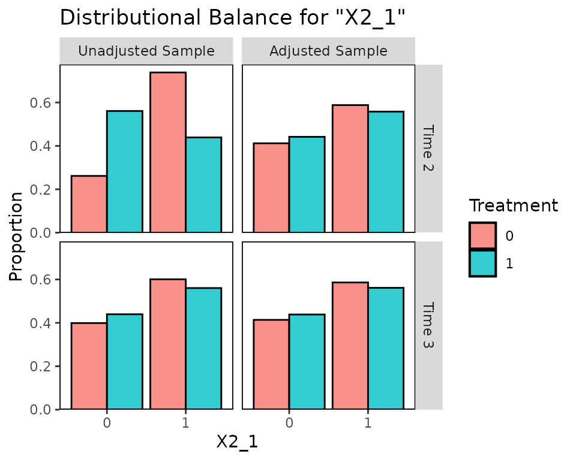

# Using cobalt with Longitudinal Treatments

This is an introduction to the use of *cobalt* with longitudinal
treatments. These occur when there are multiple treatment periods spaced
over time, with the potential for time-dependent confounding to occur. A
common way to estimate treatment effects in these scenarios is to use
marginal structural models (MSM), weighted by balancing weights. The
goal of applying weights is to simulate a sequential randomization
design, where the probability of being assigned to treatment at each
time point is independent of each unit’s prior covariate and treatment
history. For introduction to MSMs in general, see Thoemmes and Ong
([2016](#ref-thoemmesPrimerInverseProbability2016)), VanderWeele,
Jackson, and Li
([2016](#ref-vanderweeleCausalInferenceLongitudinal2016)), Cole and
Hernán ([2008](#ref-coleConstructingInverseProbability2008)), or Robins,
Hernán, and Brumback ([2000](#ref-robinsMarginalStructuralModels2000)).
The key issue addressed by this guide and *cobalt* in general is
assessing balance before each treatment period to ensure the removal of
confounding.

In preprocessing for MSMs, three types of variables are relevant:
baseline covariates, treatments, and intermediate outcomes/time-varying
covariates. The goal of balance assessment is to assess whether after
preprocessing, the resulting sample is one in which each treatment is
independent of baseline covariates, treatment history, and time-varying
covariates. The tools in *cobalt* have been developed to satisfy these
goals.

The next section describe how to use *cobalt*’s tools to assess balance
with longitudinal treatments. First, we’ll examine an example data set
and identify some tools that can be used to generate weights for MSMs.
Next we’ll use
[`bal.tab()`](https://ngreifer.github.io/cobalt/reference/bal.tab.md),
[`bal.plot()`](https://ngreifer.github.io/cobalt/reference/bal.plot.md),
and
[`love.plot()`](https://ngreifer.github.io/cobalt/reference/love.plot.md)
to assess and present balance.

## Setup

We’re going to use the `msmdata` data set in the *WeightIt* package.

``` r
library("cobalt")
library("WeightIt")
data("msmdata", package = "WeightIt")
head(msmdata)
```

    ##   X1_0 X2_0 A_1 X1_1 X2_1 A_2 X1_2 X2_2 A_3 Y_B
    ## 1    2    0   1    5    1   0    4    1   0   0
    ## 2    4    0   1    9    0   1   10    0   1   1
    ## 3    4    1   0    5    0   1    4    0   0   1
    ## 4    4    1   0    4    0   0    6    1   0   1
    ## 5    6    1   1    5    0   1    6    0   0   1
    ## 6    5    1   0    4    0   1    4    0   1   0

We have the variables `Y_B`, the outcome; `X1_0` and `X2_0`, the
baseline covariates; `X1_1` and `X2_1`, time-varying covariates measured
after treatment period 1; `X1_1` and `X2_1`, covariates measured after
treatment period 2; and `A_1`, `A_2`, and `A_3`, the treatments at each
of the three treatment periods.

The goal of balance assessment in this scenario is to ensure the
following:

1.  `A_1` is independent from `X1_0` and `X2_0`
2.  `A_2` is independent from `X1_0`, `X2_0`, `A_1,`X1_1`, and`X2_1\`
3.  `tx3` is independent from `X1_0`, `X2_0`, `A_1,`X1_1`,`X2_1`,`A_2,
    `X1_2`, and `X2_2`

Note these conditions are different from and weaker than those described
by Jackson ([2016](#ref-jacksonDiagnosticsConfoundingTimevarying2016)).
See his `confoundr` package for implementing the diagnostics he
describes.

## `bal.tab()`

To examine balance on the original data, we can specify the
treatment-covariate relationship we want to assess by using either the
formula or data frame interfaces to
[`bal.tab()`](https://ngreifer.github.io/cobalt/reference/bal.tab.md).
The formula interface requires a list of formulas, one for each
treatment, and a data set containing the relevant variables. The data
set must be in the “wide” setup, where each time point receives its own
columns and each unit has exactly one row of data. The formula interface
is similar to the *WeightIt* input seen above. The data frame interface
requires a list of treatment values for each time point and a data frame
or list of covariates for each time point. We’ll use the formula
interface here.

``` r
bal.tab(list(A_1 ~ X1_0 + X2_0,
             A_2 ~ X1_1 + X2_1 +
               A_1 + X1_0 + X2_0,
             A_3 ~ X1_2 + X2_2 +
               A_2 + X1_1 + X2_1 +
               A_1 + X1_0 + X2_0),
        data = msmdata)
```

    ## Balance summary across all time points
    ##        Times    Type Max.Diff.Un
    ## X1_0 1, 2, 3 Contin.      0.6897
    ## X2_0 1, 2, 3  Binary      0.3253
    ## X1_1    2, 3 Contin.      0.8736
    ## X2_1    2, 3  Binary      0.2994
    ## A_1     2, 3  Binary      0.1267
    ## X1_2       3 Contin.      0.4749
    ## X2_2       3  Binary      0.5945
    ## A_2        3  Binary      0.1620
    ## 
    ## Sample sizes
    ##  - Time 1
    ##     Control Treated
    ## All    3306    4194
    ##  - Time 2
    ##     Control Treated
    ## All    3701    3799
    ##  - Time 3
    ##     Control Treated
    ## All    4886    2614

Here we see a summary of balance across all time points. This displays
each variable, how many times it appears in balance tables, its type,
and the greatest imbalance for that variable across all time points.
Below this is a summary of sample sizes across time points. To request
balance on individual time points, we can use the `which.time` argument,
which can be set to one or more numbers or `.all` or `.none` (the
default). Below we’ll request balance on all time points by setting
`which.time = .all`. Doing so hides the balance summary across time
points, but this can be requested again by setting `msm.summary = TRUE`.

``` r
bal.tab(list(A_1 ~ X1_0 + X2_0,
             A_2 ~ X1_1 + X2_1 +
               A_1 + X1_0 + X2_0,
             A_3 ~ X1_2 + X2_2 +
               A_2 + X1_1 + X2_1 +
               A_1 + X1_0 + X2_0),
        data = msmdata,
        which.time = .all)
```

    ## Balance by Time Point
    ## 
    ##  - - - Time: 1 - - - 
    ## Balance Measures
    ##         Type Diff.Un
    ## X1_0 Contin.  0.6897
    ## X2_0  Binary -0.3253
    ## 
    ## Sample sizes
    ##     Control Treated
    ## All    3306    4194
    ## 
    ##  - - - Time: 2 - - - 
    ## Balance Measures
    ##         Type Diff.Un
    ## X1_1 Contin.  0.8736
    ## X2_1  Binary -0.2994
    ## A_1   Binary  0.1267
    ## X1_0 Contin.  0.5276
    ## X2_0  Binary -0.0599
    ## 
    ## Sample sizes
    ##     Control Treated
    ## All    3701    3799
    ## 
    ##  - - - Time: 3 - - - 
    ## Balance Measures
    ##         Type Diff.Un
    ## X1_2 Contin.  0.4749
    ## X2_2  Binary -0.5945
    ## A_2   Binary  0.1620
    ## X1_1 Contin.  0.5727
    ## X2_1  Binary -0.0405
    ## A_1   Binary  0.1000
    ## X1_0 Contin.  0.3614
    ## X2_0  Binary -0.0402
    ## 
    ## Sample sizes
    ##     Control Treated
    ## All    4886    2614
    ##  - - - - - - - - - - -

Here we see balance by time point. At each time point, a `bal.tab`
object is produced for that time point. These function just like regular
`bal.tab` objects.

This output will appear no matter what the treatment types are (i.e.,
binary, continuous, multi-category), but for multi-category treatments
or when the treatment types vary or for multiply imputed data, no
balance summary will be computed or displayed.

To estimate the weights, we’ll use
[`WeightIt::weightitMSM()`](https://ngreifer.github.io/WeightIt/reference/weightitMSM.html)
to fit a series of logistic regressions that generate the weights. See
the *WeightIt* documentation for more information on how to use
*WeightIt* with longitudinal treatments.

``` r
Wmsm <- weightitMSM(list(A_1 ~ X1_0 + X2_0,
                         A_2 ~ X1_1 + X2_1 +
                           A_1 + X1_0 + X2_0,
                         A_3 ~ X1_2 + X2_2 +
                           A_2 + X1_1 + X2_1 +
                           A_1 + X1_0 + X2_0),
                    data = msmdata)
```

We can use
[`bal.tab()`](https://ngreifer.github.io/cobalt/reference/bal.tab.md)
with the `weightitMSM` object generated above. Setting `un = TRUE` would
produce balance statistics before adjustment, like we did before. We’ll
set `which.time = .all` and `msm.summary = TRUE` to see balance for each
time point and across time points.

``` r
bal.tab(Wmsm, un = TRUE, which.time = .all, msm.summary = TRUE)
```

    ## Balance by Time Point
    ## 
    ##  - - - Time: 1 - - - 
    ## Balance Measures
    ##         Type Diff.Un Diff.Adj
    ## X1_0 Contin.  0.6897   0.0026
    ## X2_0  Binary -0.3253  -0.0239
    ## 
    ## Effective sample sizes
    ##            Control Treated
    ## Unadjusted 3306.    4194. 
    ## Adjusted    845.79   899.4
    ## 
    ##  - - - Time: 2 - - - 
    ## Balance Measures
    ##         Type Diff.Un Diff.Adj
    ## X1_1 Contin.  0.8736   0.0531
    ## X2_1  Binary -0.2994  -0.0299
    ## A_1   Binary  0.1267   0.0065
    ## X1_0 Contin.  0.5276   0.0183
    ## X2_0  Binary -0.0599  -0.0299
    ## 
    ## Effective sample sizes
    ##            Control Treated
    ## Unadjusted 3701.   3799.  
    ## Adjusted    912.87  829.87
    ## 
    ##  - - - Time: 3 - - - 
    ## Balance Measures
    ##         Type Diff.Un Diff.Adj
    ## X1_2 Contin.  0.4749   0.0643
    ## X2_2  Binary -0.5945   0.0096
    ## A_2   Binary  0.1620  -0.0054
    ## X1_1 Contin.  0.5727   0.0657
    ## X2_1  Binary -0.0405  -0.0248
    ## A_1   Binary  0.1000  -0.0262
    ## X1_0 Contin.  0.3614   0.0342
    ## X2_0  Binary -0.0402   0.0147
    ## 
    ## Effective sample sizes
    ##            Control Treated
    ## Unadjusted 4886.   2614.  
    ## Adjusted   1900.26  600.12
    ##  - - - - - - - - - - - 
    ## 
    ## Balance summary across all time points
    ##        Times    Type Max.Diff.Un Max.Diff.Adj
    ## X1_0 1, 2, 3 Contin.      0.6897       0.0342
    ## X2_0 1, 2, 3  Binary      0.3253       0.0299
    ## X1_1    2, 3 Contin.      0.8736       0.0657
    ## X2_1    2, 3  Binary      0.2994       0.0299
    ## A_1     2, 3  Binary      0.1267       0.0262
    ## X1_2       3 Contin.      0.4749       0.0643
    ## X2_2       3  Binary      0.5945       0.0096
    ## A_2        3  Binary      0.1620       0.0054
    ## 
    ## Effective sample sizes
    ##  - Time 1
    ##            Control Treated
    ## Unadjusted 3306.    4194. 
    ## Adjusted    845.79   899.4
    ##  - Time 2
    ##            Control Treated
    ## Unadjusted 3701.   3799.  
    ## Adjusted    912.87  829.87
    ##  - Time 3
    ##            Control Treated
    ## Unadjusted 4886.   2614.  
    ## Adjusted   1900.26  600.12

Note that to add covariates, we must use `addl.list` (which can be
abbreviated as `addl`), which functions like `addl` in point treatments.
The input to `addl.list` must be a list of covariates for each time
point, or a single data data frame of variables to be assessed at all
time points. The same goes for adding distance variables, which must be
done with `distance.list` (which can be abbreviated as `distance`).

Next we’ll use
[`bal.plot()`](https://ngreifer.github.io/cobalt/reference/bal.plot.md)
to more finely examine covariate balance.

## `bal.plot()`

We can compare distributions of covariates across treatment groups for
each time point using
[`bal.plot()`](https://ngreifer.github.io/cobalt/reference/bal.plot.md),
just as we could with point treatments.

``` r
bal.plot(Wmsm, var.name = "X1_0", which = "both",
         type = "histogram")
```


Balance for variables that only appear in certain time points will only
be displayed at those time points:

``` r
bal.plot(Wmsm, var.name = "X2_1", which = "both")
```



As with
[`bal.tab()`](https://ngreifer.github.io/cobalt/reference/bal.tab.md),
`which.time` can be specified to limit output to chosen time points.

Finally, we’ll examine using
[`love.plot()`](https://ngreifer.github.io/cobalt/reference/love.plot.md)
with longitudinal treatments to display balance for presentation.

## `love.plot()`

[`love.plot()`](https://ngreifer.github.io/cobalt/reference/love.plot.md)
works with longitudinal treatments just as it does with point
treatments, except that the user can choose whether to display separate
plots for each time point or one plot with the summary across time
points. As with
[`bal.tab()`](https://ngreifer.github.io/cobalt/reference/bal.tab.md),
the user can set `which.time` to display only certain time points,
including setting it to `.all` to display all time points (note that not
all variables will be present in all time points). When set to `.none`
(the default), the summary across time points is displayed. The
`agg.fun` argument is set to `"max"` by default.

``` r
love.plot(Wmsm, binary = "std")
```


``` r
love.plot(Wmsm, binary = "std", which.time = .all)
```


## Other Packages

Here we used *WeightIt* to generate our MSM weights, but *cobalt* is
compatible with other packages for longitudinal treatments as well.
`CBMSM` objects from the *CBPS* package and `iptw` objects from the
*twang* package can be used in place of the `weightitMSM` object in the
above examples. In addition, users who have generated balancing weights
outside any of these package can specify an argument to `weights` in
[`bal.tab()`](https://ngreifer.github.io/cobalt/reference/bal.tab.md)
with the formula or data frame methods to assess balance using those
weights, or they can use the default method of
[`bal.tab()`](https://ngreifer.github.io/cobalt/reference/bal.tab.md) to
supply an object containing any of the objects required for balance
assessment.

Note that *CBPS* estimates and assesses balance on MSM weights
differently from *twang* and *cobalt*. Its focus is on ensuring balance
across all treatment history permutations, whereas *cobalt* focuses on
evaluating the similarity to sequential randomization. For this reason,
it may appear that `CBMSM` objects have different balance qualities as
measured by the two packages.

## References

Cole, Stephen R., and Miguel A Hernán. 2008. “Constructing Inverse
Probability Weights for Marginal Structural Models.” *American Journal
of Epidemiology* 168 (6): 656–64. <https://doi.org/10.1093/aje/kwn164>.

Jackson, John W. 2016. “Diagnostics for Confounding of Time-Varying and
Other Joint Exposures:” *Epidemiology* 27 (6): 859–69.
<https://doi.org/10.1097/EDE.0000000000000547>.

Robins, James M., Miguel Ángel Hernán, and Babette Brumback. 2000.
“Marginal Structural Models and Causal Inference in Epidemiology.”
*Epidemiology* 11 (5): 550–60.
<https://doi.org/10.1097/00001648-200009000-00011>.

Thoemmes, Felix J., and Anthony D. Ong. 2016. “A Primer on Inverse
Probability of Treatment Weighting and Marginal Structural Models.”
*Emerging Adulthood* 4 (1): 40–59.
<https://doi.org/10.1177/2167696815621645>.

VanderWeele, Tyler J., John W. Jackson, and Shanshan Li. 2016. “Causal
Inference and Longitudinal Data: A Case Study of Religion and Mental
Health.” *Social Psychiatry and Psychiatric Epidemiology* 51 (11):
1457–66. <https://doi.org/10.1007/s00127-016-1281-9>.
