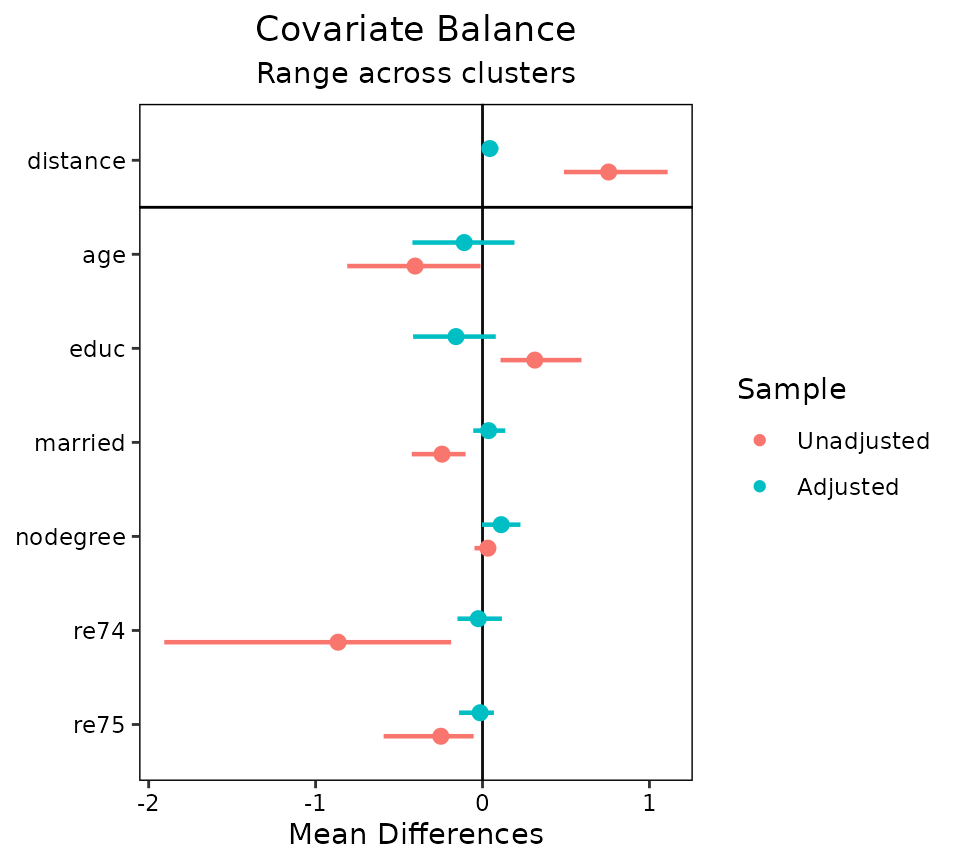
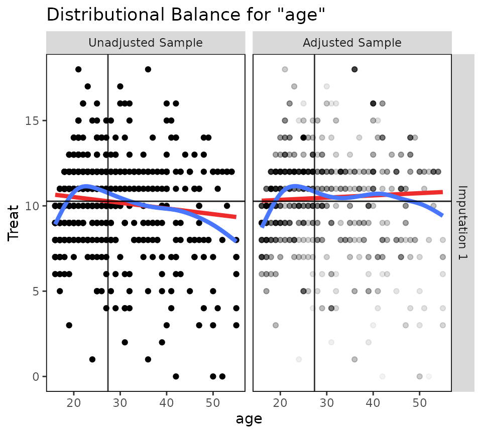
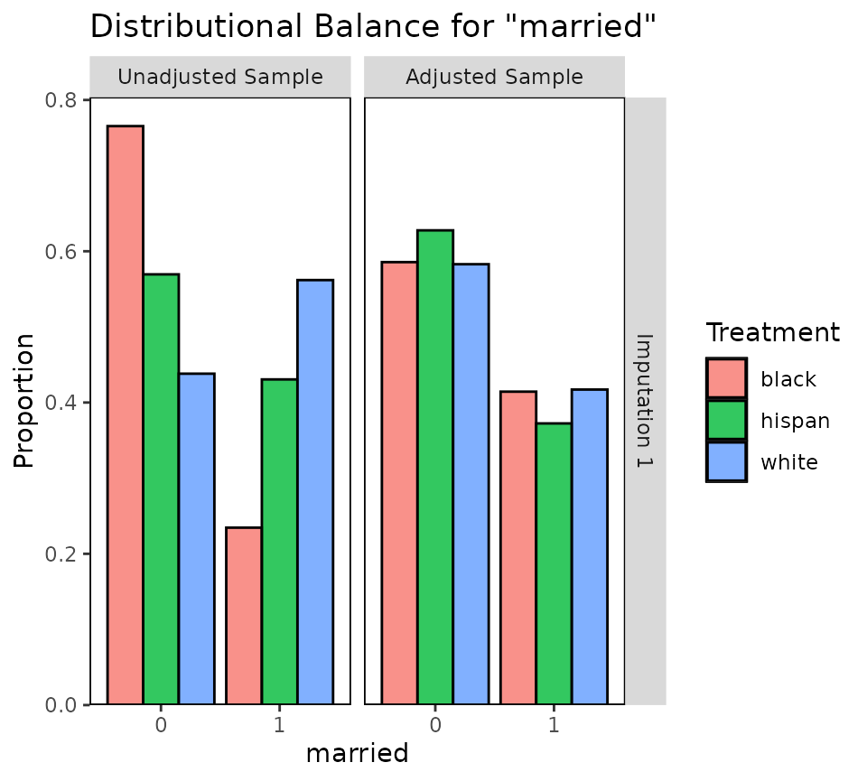
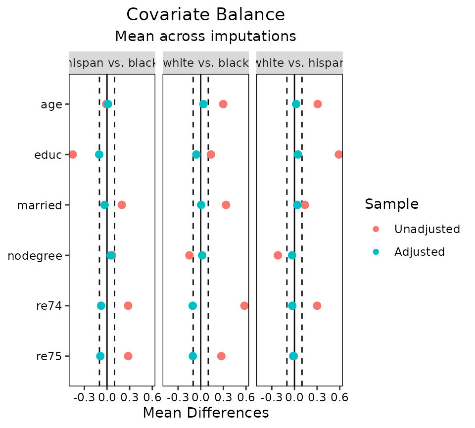

# Using cobalt with Clustered, Multiply Imputed, and Other Segmented Data

This is a guide for the use of *cobalt* with more complicated data than
is typical in studies using propensity scores and similar methods. In
particular, this guide will explain *cobalt*’s features for handling
multilevel or grouped data and data arising from multiple imputation.
The features described here set *cobalt* apart from other packages that
assess balance because they exist only in *cobalt*. It will be assumed
that the basic functions of *cobalt* are understood; this guide will
only address issues that are unique to these data scenarios.

## *cobalt* and Segmented Data

First, let’s understand segmented data. Segmented data arises when the
data involved in balance assessment needs to be split into segments to
appropriately assess balance. These scenarios include clustered (e.g.,
multilevel) data, in which case balance should be assessed within each
cluster; data arising from a sequential study, in which case balance
should be assessed at each time point; multi-category treatments, in
which case balance should be assessed for each pair of treatments; and
multiply imputed data, in which case balance should be assessed within
each imputation. *cobalt* can handle all these scenarios simultaneously,
but how it does so may be a little complicated. This vignette explains
how these scenarios are handled.

At the core is the idea that the most basic unit of balance assessment
is a balance statistic for a covariate. For binary treatments or pairs
of treatment levels, this can be the (standardized) mean difference,
Kolmogorov-Smirnoff (KS) statistic, etc. For continuous treatments, this
is the usually treatment-covariate correlation. These statistics are
generated by
[`bal.tab()`](https://ngreifer.github.io/cobalt/reference/bal.tab.md)
and can be plotted using
[`love.plot()`](https://ngreifer.github.io/cobalt/reference/love.plot.md)
when the data are not segmented. When the data are segmented, these
statistics need to be generated within each segment. When the
segmentation occurs in several ways in the same dataset (e.g., with
clustered and multiply imputed data, or with longitudinal data with
multi-category treatments), balance assessment should reflect each layer
of segmentation.

Although the idea of simply splitting data into segments is simple,
there are a few options and limitations in *cobalt* that are important
to consider. The basic idea is the same regardless of how the data are
segmented: for each layer of segmentation, balance is assessed within
segments of that layer, and the layers stack hierarchically. For
example, for clustered and multiply imputed data, first the data are
split by cluster; within each cluster, the data are split by imputation;
balance statistics are computed within each imputation within each
cluster. In some cases, a summary of balance across segments can be
produced to simplify balance assessment. Matching and weighting are
compatible with segmented data, but subclassification is its own special
form of segmentation that is treated differently and will not be
considered here.

Each of *cobalt*’s primary functions
([`bal.tab()`](https://ngreifer.github.io/cobalt/reference/bal.tab.md),
[`bal.plot()`](https://ngreifer.github.io/cobalt/reference/bal.plot.md),
and
[`love.plot()`](https://ngreifer.github.io/cobalt/reference/love.plot.md))
has features to handle segmented data sets. The following sections
describe for each data scenario the relevant features of each function.
We’ll take a look at a few common examples of segmented data: clustered
data, multiply imputed data, and multi-category and multiply imputed
data. For longitudinal treatments, see
[`vignette("longitudinal-treat")`](https://ngreifer.github.io/cobalt/articles/longitudinal-treat.md).

## Clustered Data

In clustered data, the data set must contain a variable denoting the
group each individual belongs to. This may be a group considered a
nuisance that must be accounted for to eliminate confounding (e.g.,
hospitals in a multi-site medical treatment study), or a group of
concern for effect moderation (e.g., race or gender). In the examples
below, we will imagine that we are interested in the ATT of `treat` on
`re78` stratified by `race`. Thus, we will condition on the propensity
score within each cluster.

First, let’s estimate propensity scores and perform matching within each
race group. We can do this by performing separate analyses within each
cluster, but we can also use exact matching in *MatchIt* to ensure
matches occur within clusters. It is important to note that this
analysis does not necessarily represent a sound statistical analysis and
is being used for illustrative purposes only.

``` r
library("cobalt")
data("lalonde", package = "cobalt")

library("MatchIt")
m.out <- matchit(treat ~ race * (age + educ + married + nodegree + re74 + re75), 
                 data = lalonde,
                 method = "nearest",
                 exact = "race", 
                 replace = TRUE,
                 ratio = 2)
```

### `bal.tab()`

The output produced by
[`bal.tab()`](https://ngreifer.github.io/cobalt/reference/bal.tab.md)
with clustered data contains balance tables for each cluster and a
summary of balance across clusters. To use
[`bal.tab()`](https://ngreifer.github.io/cobalt/reference/bal.tab.md)
with groups, there are four arguments that should be considered. These
are `cluster`, `which.cluster`, `cluster.summary`, and `cluster.fun`.

- `cluster` is a vector of group membership for each unit or the name of
  a variable in a provided data set containing group membership.

- `which.cluster` determines for which clusters balance tables are to be
  displayed, if any. (Default: display all clusters)

- `cluster.summary` determines whether the cluster summary is to be
  displayed or not. (Default: hide the cluster summary)

- `cluster.fun` determines which function(s) are used to combine balance
  statistics across clusters for the cluster summary. (Default: when
  `abs = FALSE`, minimum, mean, and maximum; when `abs = TRUE`, mean and
  maximum)

The arguments are in addition to the other arguments that are used with
[`bal.tab()`](https://ngreifer.github.io/cobalt/reference/bal.tab.md) to
display balance. `cluster.summary` and `cluster.fun` can also be set as
global options by using
[`set.cobalt.options()`](https://ngreifer.github.io/cobalt/reference/set.cobalt.options.md).
Let’s examine balance on our data within each `race` group.

``` r
bal.tab(m.out, cluster = "race")
```

    ## Balance by cluster
    ## 
    ##  - - - Cluster: black - - - 
    ## Balance Measures
    ##              Type Diff.Adj
    ## distance Distance   0.0150
    ## age       Contin.  -0.1001
    ## educ      Contin.   0.0794
    ## married    Binary   0.0288
    ## nodegree   Binary  -0.0032
    ## re74      Contin.  -0.1501
    ## re75      Contin.  -0.1406
    ## 
    ## Sample sizes
    ##                          0   1
    ## All                  87.   156
    ## Matched (ESS)        41.53 156
    ## Matched (Unweighted) 76.   156
    ## Unmatched            11.     0
    ## 
    ##  - - - Cluster: hispan - - - 
    ## Balance Measures
    ##              Type Diff.Adj
    ## distance Distance   0.0947
    ## age       Contin.   0.1914
    ## educ      Contin.  -0.4159
    ## married    Binary   0.1364
    ## nodegree   Binary   0.2273
    ## re74      Contin.   0.1161
    ## re75      Contin.   0.0683
    ## 
    ## Sample sizes
    ##                          0  1
    ## All                  61.   11
    ## Matched (ESS)        15.12 11
    ## Matched (Unweighted) 18.   11
    ## Unmatched            43.    0
    ## 
    ##  - - - Cluster: white - - - 
    ## Balance Measures
    ##              Type Diff.Adj
    ## distance Distance   0.0216
    ## age       Contin.  -0.4201
    ## educ      Contin.  -0.1403
    ## married    Binary  -0.0556
    ## nodegree   Binary   0.1111
    ## re74      Contin.  -0.0417
    ## re75      Contin.   0.0298
    ## 
    ## Sample sizes
    ##                           0  1
    ## All                  281.   18
    ## Matched (ESS)         25.92 18
    ## Matched (Unweighted)  31.   18
    ## Unmatched            250.    0
    ##  - - - - - - - - - - - - - -

Here we see balance tables for each cluster. These are the same output
we would see if we use
[`bal.tab()`](https://ngreifer.github.io/cobalt/reference/bal.tab.md)
for each cluster separately (e.g., using the `subset` argument). All the
commands that work for
[`bal.tab()`](https://ngreifer.github.io/cobalt/reference/bal.tab.md)
also work here with the same results. Next, we can request a balance
summary across clusters and hide the individual clusters by setting
`which.cluster = .none`:

``` r
bal.tab(m.out, cluster = "race", which.cluster = .none)
```

    ## Balance summary across all clusters
    ##              Type Min.Diff.Adj Mean.Diff.Adj Max.Diff.Adj
    ## distance Distance       0.0150        0.0438       0.0947
    ## age       Contin.      -0.4201       -0.1096       0.1914
    ## educ      Contin.      -0.4159       -0.1590       0.0794
    ## married    Binary      -0.0556        0.0366       0.1364
    ## nodegree   Binary      -0.0032        0.1117       0.2273
    ## re74      Contin.      -0.1501       -0.0252       0.1161
    ## re75      Contin.      -0.1406       -0.0142       0.0683
    ## 
    ## Total sample sizes across clusters
    ##                           0   1
    ## All                  429.   185
    ## Matched (ESS)         82.57 185
    ## Matched (Unweighted) 125.   185
    ## Unmatched            304.     0

This table presents the minimum, mean, and maximum balance statistics
for each variable across clusters. Setting `un = TRUE` will also display
the same values for the adjusted data set. Setting `abs = TRUE` requests
summaries of absolute balance statistics which displays the extremeness
of balance statistics for each variable; thus, if, for example, in some
groups there are large negative mean differences and in other groups
there are large positive mean differences, this table will display large
mean differences, even though the average mean difference is close to 0.
While it’s important to know the average balance statistic overall,
assessing the absolute balance statistics provides more information
about balance within each cluster rather than in aggregate.

To examine balance for just a few clusters at a time, users can enter
values for `which.cluster`. This can be a vector of clusters indices
(i.e., 1, 2, 3, etc.) or names (e.g., “black”, “hispan”, “white”). Users
also specify `which.cluster = .none` as above to omit cluster balance
for all clusters and just see the summary across clusters. Users can
force display of the summary across clusters by specifying `TRUE` or
`FALSE` for `cluster.summary`. When `which.cluster = .none`,
`cluster.summary` will automatically be set to `TRUE` (or else there
wouldn’t be any output!). When examining balance within a few groups, it
can be more helpful to examine balance within each group and ignore the
summary. Below are examples of the use of `which.cluster` and
`cluster.summary` to change
[`bal.tab()`](https://ngreifer.github.io/cobalt/reference/bal.tab.md)
output.

``` r
#Just for black
bal.tab(m.out, cluster = "race", which.cluster = "black")
```

    ## Balance by cluster
    ## 
    ##  - - - Cluster: black - - - 
    ## Balance Measures
    ##              Type Diff.Adj
    ## distance Distance   0.0150
    ## age       Contin.  -0.1001
    ## educ      Contin.   0.0794
    ## married    Binary   0.0288
    ## nodegree   Binary  -0.0032
    ## re74      Contin.  -0.1501
    ## re75      Contin.  -0.1406
    ## 
    ## Sample sizes
    ##                          0   1
    ## All                  87.   156
    ## Matched (ESS)        41.53 156
    ## Matched (Unweighted) 76.   156
    ## Unmatched            11.     0
    ##  - - - - - - - - - - - - - -

``` r
#Just the balance summary across clusters with only the mean
bal.tab(m.out, cluster = "race", which.cluster = .none,
        cluster.fun = "mean")
```

    ## Balance summary across all clusters
    ##              Type Mean.Diff.Adj
    ## distance Distance        0.0438
    ## age       Contin.       -0.1096
    ## educ      Contin.       -0.1590
    ## married    Binary        0.0366
    ## nodegree   Binary        0.1117
    ## re74      Contin.       -0.0252
    ## re75      Contin.       -0.0142
    ## 
    ## Total sample sizes across clusters
    ##                           0   1
    ## All                  429.   185
    ## Matched (ESS)         82.57 185
    ## Matched (Unweighted) 125.   185
    ## Unmatched            304.     0

These can also be set as global options by using, for example,
`set.cobalt.options(cluster.fun = "mean")`, which allows users not to
type a non-default option every time they call
[`bal.tab()`](https://ngreifer.github.io/cobalt/reference/bal.tab.md).

### `bal.plot()`

[`bal.plot()`](https://ngreifer.github.io/cobalt/reference/bal.plot.md)
functions as it does with non-clustered data, except that multiple plots
can be produced at the same time displaying balance for each cluster.
The arguments to
[`bal.plot()`](https://ngreifer.github.io/cobalt/reference/bal.plot.md)
are the same as those for
[`bal.tab()`](https://ngreifer.github.io/cobalt/reference/bal.tab.md),
except that `cluster.summary` is absent. Below is an example of the use
of
[`bal.plot()`](https://ngreifer.github.io/cobalt/reference/bal.plot.md)
with clustered data:

``` r
bal.plot(m.out, var.name = "age", cluster = "race", which = "both")
```


Balance plots for each cluster are displayed next to each other. You can
specify `which.cluster` as with
[`bal.tab()`](https://ngreifer.github.io/cobalt/reference/bal.tab.md) to
restrict plotting to a subset of clusters.

### `love.plot()`

[`love.plot()`](https://ngreifer.github.io/cobalt/reference/love.plot.md)
shines with clustered data because there are several options that are
unique to *cobalt* and help with the visual display of balance. One way
to display cluster balance with
[`love.plot()`](https://ngreifer.github.io/cobalt/reference/love.plot.md)
is to produce different plots for each cluster, as
[`bal.plot()`](https://ngreifer.github.io/cobalt/reference/bal.plot.md)
does. This method should not be used with many clusters, or the plots
will be unreadable. In our present example, this is not an issue. To do
so, the `which.cluster` argument in
[`bal.tab()`](https://ngreifer.github.io/cobalt/reference/bal.tab.md) or
[`love.plot()`](https://ngreifer.github.io/cobalt/reference/love.plot.md)
must be set to the names or indices of the clusters for which balance is
to be plotted. If `which.cluster` is set to `.all` (the default), all
clusters will be plotted. Below is an example:

``` r
love.plot(m.out, cluster = "race")
```


These plots function like those from using
[`love.plot()`](https://ngreifer.github.io/cobalt/reference/love.plot.md)
with non-clustered data, except that they cannot be sorted based on the
values of the balance statistics (they can still be sorted
alphabetically, though). This is to ensure that the covariates line up
across the plots. The same axis limits will apply to all plots.

Second, balance can be displayed summarizing across clusters by plotting
an aggregate function (i.e., the mean or maximum) of the balance
statistic for each covariate across clusters. To do this,
`which.cluster` in the `love.plot` command must be set to `.none`. To
change which aggregate function is displayed, use the argument to
`agg.fun`, which may be “mean” or “max”. Below is an example:

``` r
love.plot(m.out, cluster = "race",
          which.cluster = .none,
          agg.fun = "mean")
```


A third option is to set `agg.fun = "range"` (the default), which
produces a similar plot as above except that the minimum and maximum
values of the balance statistics for each covariate are displayed as
well. See below for an example:

``` r
love.plot(m.out, cluster = "race", which.cluster = .none, agg.fun = "range")
```



Each point represents the mean balance statistic, and the bars represent
intervals bounded by the minimum and maximum of each balance statistic.
This display can be especially helpful with many clusters given that the
mean alone may not tell the whole story. In some cases, it might be
useful to set limits on the x-axis by using the `limits` argument in
[`love.plot()`](https://ngreifer.github.io/cobalt/reference/love.plot.md);
doing so may cut off some of the ranges, but whatever is left will be
displayed. All
[`love.plot()`](https://ngreifer.github.io/cobalt/reference/love.plot.md)
arguments work with these methods as they do in the case of
non-clustered data. When `var.order` is specified as `"unadjusted"` or
`"adjusted"`, the ordering will occur on the mean balance statistic when
using `agg.fun = "range"`. Only one argument to `stats` is allowed when
segmented data produces more than one plot (i.e., as it would with
`which.cluster = .all`).

## Multiply Imputed Data

Multiply imputed data works in a very similar way to clustered data,
except the “grouping” variable refers to imputations rather than
clusters. Thus, each row belongs to one imputation (i.e., the data set
should be in “long” format). The data set used should only include the
imputed data sets and not the original data set with missing values. The
imputed data sets can be of different sizes (i.e., because matching
reduced the size of each differently), but it is preferred that they are
the same size and weights are used to indicate which units belong to the
sample and which do not.

In the example below, we will use a version of the Lalonde data set with
some values missing. We will use the *mice* package to implement
multiple imputation with chained equations. We will perform the “within”
approach using the *MatchThem* to perform propensity score weighting
within each imputation with `educ` as the continuous treatment
(substantively this analysis makes no sense and is just for
illustration).

``` r
data("lalonde_mis", package = "cobalt")
set.seed(100)

#Generate imputed data sets
m <- 10 #number of imputed data sets
imp.out <- mice::mice(lalonde_mis, m = m, print = FALSE) 


#Performing generalized propensity score weighting in each imputation
wt.out <- MatchThem::weightthem(educ ~ age + race + married + 
                                    re74 + re75, datasets = imp.out, 
                                approach = "within", method = "glm")
```

### `bal.tab()`

There are a few ways to use
[`bal.tab()`](https://ngreifer.github.io/cobalt/reference/bal.tab.md)
with our imputed data sets. When using the `mimids` or `wimids` methods
for *MatchThem* objects, only the output object needs to be supplied.
When using other methods, an argument to `imp` can be supplied; this
should contain the imputation identifiers for each unit or the name of a
variable in a supplied dataset (e.g., through the `data` argument) that
contains the imputation identifiers. Alternatively, the `mids` object
resulting from the call to *mice* can be supplied to the `data`
argument, which automatically populates `imp`. There are four arguments
that are only relevant to imputed data:

- `imp` is a vector of imputation numbers for each unit or the name of a
  variable in an available data set containing the imputation numbers.
  If `data` is a `mids` object or if the `mimids` or `wimids` methods
  are used, this doesn’t need to be specified.

- `which.imp` determines for which imputation balance assessment is to
  be displayed. Often it can be useful to examine balance in just a few
  imputations for a detailed examination of what is going on. Can be
  `.all` to display all imputations (not recommended), `.none` to
  display none, or a vector providing the imputation numbers for the
  desired imputations. (Default: no imputations are displayed.)

- `imp.summary` determines whether to display a summary of balance
  across imputations. (Default: the summary of balance across
  imputations is displayed.)

- `imp.fun` determines which function(s) are used to combine balance
  statistics across imputations for the summary of balance across
  imputations. (Default: when `abs = FALSE`, minimum, mean, and maximum;
  when `abs = TRUE`, mean and maximum)

`imp.summary` and `imp.fun` can also be set as global options by using
[`set.cobalt.options()`](https://ngreifer.github.io/cobalt/reference/set.cobalt.options.md)
like the corresponding cluster options.

In many cases, not all variables are imputed, and often the treatment
variable is not imputed. If each imputation has the same number of
units, you can specify other arguments (e.g., treatment, distance) by
specifying an object of the length of one imputation, and this vector
will be applied to all imputations. This will come in handy when
supplying additional covariates that weren’t involved in the imputation
or propensity score estimation through `addl`. To do this, the imputed
data set must be sorted by imputation and unit ID.

Because we’re using a `wimids` object, we can just call
[`bal.tab()`](https://ngreifer.github.io/cobalt/reference/bal.tab.md)
with it as the first argument.

``` r
#Checking balance on the output object
bal.tab(wt.out)
```

    ## Balance summary across all imputations
    ##                Type Min.Corr.Adj Mean.Corr.Adj Max.Corr.Adj
    ## age         Contin.       0.0248        0.0390       0.0488
    ## race_black   Binary      -0.0550       -0.0433      -0.0366
    ## race_hispan  Binary       0.0066        0.0091       0.0118
    ## race_white   Binary       0.0297        0.0365       0.0481
    ## married      Binary       0.0312        0.0429       0.0553
    ## re74        Contin.      -0.0147       -0.0039       0.0071
    ## re75        Contin.      -0.0206       -0.0046       0.0016
    ## 
    ## Average effective sample sizes across imputations
    ##             Total
    ## Unadjusted 614.  
    ## Adjusted   541.56

First, we see a balance summary across all the imputations. This table
presents the minimum, mean, and maximum balance statistics for each
variable across imputations. Setting `un = TRUE` will also display the
same values for the adjusted data set. Setting `abs = TRUE` will make
[`bal.tab()`](https://ngreifer.github.io/cobalt/reference/bal.tab.md)
report summaries of the absolute values of the balance statistics. This
table functions in the same way as the table for balance across
clusters. Below is the average sample size across imputations; in some
matching and weighting schemes, the sample size (or effective sample
size) may differ across imputations.

When requesting the balance summary across imputations, the `thresholds`
argument needs special care. Because multiple balance summaries are
produced for each covariate by default, simply supplying `thresholds` is
not enough to identify which summary of the balance statistics across
imputations is the one for which the threshold is to be applied. The
solution to this is to use `imp.fun` to specify which summary is
desired; the threshold will be applied to that summary. For example, to
request a threshold on the maximum absolute treatment-covariate
correlation across imputations, you could run

``` r
bal.tab(wt.out, thresholds = c(c = .05),
        imp.fun = "max", abs = TRUE)
```

    ## Balance summary across all imputations
    ##                Type Max.Corr.Adj         R.Threshold
    ## age         Contin.       0.0488     Balanced, <0.05
    ## race_black   Binary       0.0550 Not Balanced, >0.05
    ## race_hispan  Binary       0.0118     Balanced, <0.05
    ## race_white   Binary       0.0481     Balanced, <0.05
    ## married      Binary       0.0553 Not Balanced, >0.05
    ## re74        Contin.       0.0147     Balanced, <0.05
    ## re75        Contin.       0.0206     Balanced, <0.05
    ## 
    ## Balance tally for treatment correlations
    ##                     count
    ## Balanced, <0.05         5
    ## Not Balanced, >0.05     2
    ## 
    ## Variable with the greatest treatment correlation
    ##  Variable Max.Corr.Adj         R.Threshold
    ##   married       0.0553 Not Balanced, >0.05
    ## 
    ## Average effective sample sizes across imputations
    ##             Total
    ## Unadjusted 614.  
    ## Adjusted   541.56

To view balance on individual imputations, you can specify an imputation
number to `which.imp`. (The summary across imputations is automatically
hidden but can be forced to be displayed using `imp.summary`.)

``` r
bal.tab(wt.out, which.imp = 1)
```

    ## Balance by imputation
    ## 
    ##  - - - Imputation 1 - - - 
    ## Balance Measures
    ##                Type Corr.Adj
    ## age         Contin.   0.0488
    ## race_black   Binary  -0.0550
    ## race_hispan  Binary   0.0089
    ## race_white   Binary   0.0481
    ## married      Binary   0.0463
    ## re74        Contin.   0.0023
    ## re75        Contin.  -0.0011
    ## 
    ## Effective sample sizes
    ##             Total
    ## Unadjusted 614.  
    ## Adjusted   530.63
    ##  - - - - - - - - - - - - - -

As with clustered data, all
[`bal.tab()`](https://ngreifer.github.io/cobalt/reference/bal.tab.md)
options work as with non-imputed data. Indeed, the functions for
clustered and imputed data are nearly identical except that for imputed
data,
[`bal.tab()`](https://ngreifer.github.io/cobalt/reference/bal.tab.md)
computes the average sample size across imputations, whereas for other
forms of segmented data,
[`bal.tab()`](https://ngreifer.github.io/cobalt/reference/bal.tab.md)
computes the total sample size across groups.

### `bal.plot()`

[`bal.plot()`](https://ngreifer.github.io/cobalt/reference/bal.plot.md)
works with imputed data as it does with non-imputed data, except that
multiple plots can be produced displaying balance for multiple
imputations at a time. The arguments to
[`bal.plot()`](https://ngreifer.github.io/cobalt/reference/bal.plot.md)
are the same as those for
[`bal.tab()`](https://ngreifer.github.io/cobalt/reference/bal.tab.md),
except that `imp.summary` is absent. Below is an example of the use of
[`bal.plot()`](https://ngreifer.github.io/cobalt/reference/bal.plot.md)
with imputed and weighted data from *MatchThem*, examining balance in
the first imputation:

``` r
bal.plot(wt.out, which.imp = 1, var.name = "age", which = "both")
```



When many imputations are generated, it is recommended not to plot all
at the same time by specifying an argument to `which.imp`, as done
above. When `which.imp` is set to `.none`, data are combined across
imputation to produce a single plot, which can act as a summary
heuristic but which may obscure imbalances occurring in only a few
imputations and not others.

### `love.plot()`

[`love.plot()`](https://ngreifer.github.io/cobalt/reference/love.plot.md)
functions with imputed data as it does with clustered data. It is not
recommended to display balance for multiple imputations at a time, and
rather to display balance summarized across imputations:

``` r
love.plot(wt.out, thresholds = c(c = .05))
```


Often these ranges will be small if the imputed data sets are very
similar to each other, but the more imputations are generated, the wider
the ranges tend to be. Unlike with
[`bal.tab()`](https://ngreifer.github.io/cobalt/reference/bal.tab.md),
`thresholds` can be used with
[`love.plot()`](https://ngreifer.github.io/cobalt/reference/love.plot.md)
without specifying an argument to `agg.fun`.

## Multi-Category Treatments with Multiply Imputed Data

So far we’ve seen how *cobalt* functions work with one layer of data
segmentation, but now let’s see what it’s like to work with two or more
layers of segmentation. As an example, we’ll first look at multiply
imputed data with a multi-category treatment. With multi-category
treatments, balance is typically assessed by examining balance
statistics computed for pairs of treatments. With multi-category and
multiply imputed data, the data is segmented both by imputation and by
treatment pair.

We’ll use the three-category `race` variable as our multi-category
treatment and use the same imputed data as above. Again, the *MatchThem*
package can be used to estimate weights in multiply imputed data. We’ll
use propensity score weighting to estimate the ATE of `race`. As before,
this analysis makes no sense substantively and is just for illustration.

``` r
#Estimate weights within each imputation using propensity scores
wt3.out <- MatchThem::weightthem(race ~ age + educ + married + 
                                     nodegree + re74 + re75, 
                                 datasets = imp.out, approach = "within", 
                                 method = "glm", estimand = "ATE")
```

### `bal.tab()`

Using
[`bal.tab()`](https://ngreifer.github.io/cobalt/reference/bal.tab.md) on
the resulting object does the following: for each pair of treatments,
balance is assessed for each imputation and aggregated across
imputations. That is, for each pair of treatments, everything described
in the previous section will occur.

``` r
bal.tab(wt3.out)
```

    ## Balance by treatment pair
    ## 
    ##  - - - black (0) vs. hispan (1) - - - 
    ## Balance summary across all imputations
    ##             Type Min.Diff.Adj Mean.Diff.Adj Max.Diff.Adj
    ## age      Contin.      -0.0113        0.0133       0.0261
    ## educ     Contin.      -0.1193       -0.1034      -0.0738
    ## married   Binary      -0.0420       -0.0321      -0.0250
    ## nodegree  Binary       0.0385        0.0501       0.0563
    ## re74     Contin.      -0.1112       -0.0779      -0.0254
    ## re75     Contin.      -0.1134       -0.0881      -0.0574
    ## 
    ## Average effective sample sizes across imputations
    ##             black hispan
    ## Unadjusted 243.     72. 
    ## Adjusted   157.22   55.7
    ## 
    ##  - - - black (0) vs. white (1) - - - 
    ## Balance summary across all imputations
    ##             Type Min.Diff.Adj Mean.Diff.Adj Max.Diff.Adj
    ## age      Contin.       0.0209        0.0353       0.0494
    ## educ     Contin.      -0.0714       -0.0574      -0.0291
    ## married   Binary      -0.0001        0.0054       0.0105
    ## nodegree  Binary       0.0118        0.0192       0.0231
    ## re74     Contin.      -0.1350       -0.1062      -0.0882
    ## re75     Contin.      -0.1213       -0.1044      -0.0895
    ## 
    ## Average effective sample sizes across imputations
    ##             black  white
    ## Unadjusted 243.   299.  
    ## Adjusted   157.22 260.72
    ## 
    ##  - - - hispan (0) vs. white (1) - - - 
    ## Balance summary across all imputations
    ##             Type Min.Diff.Adj Mean.Diff.Adj Max.Diff.Adj
    ## age      Contin.       0.0122        0.0220       0.0399
    ## educ     Contin.       0.0375        0.0460       0.0524
    ## married   Binary       0.0315        0.0375       0.0448
    ## nodegree  Binary      -0.0337       -0.0310      -0.0224
    ## re74     Contin.      -0.0628       -0.0282       0.0030
    ## re75     Contin.      -0.0401       -0.0163       0.0107
    ## 
    ## Average effective sample sizes across imputations
    ##            hispan  white
    ## Unadjusted   72.  299.  
    ## Adjusted     55.7 260.72
    ##  - - - - - - - - - - - - - - - - - - - - - - - -

Other options can be supplied to choose how balance is computed with
multi-category treatments; these are described at `?bal.tab.multi` and
in the main vignette. Importantly, though, a balance summary across
treatment pairs is not available.

### `bal.plot()`

[`bal.plot()`](https://ngreifer.github.io/cobalt/reference/bal.plot.md)
works with multi-category treatments the same way it does with binary
treatments. All treatment levels are displayed on the same plot. As
before, with multiply imputed data, balance can be examined on one or
more imputations at a time.

``` r
bal.plot(wt3.out, var.name = "married", which.imp = 1,
         which = "both")
```



### `love.plot()`

With multiple layers of segmentation,
[`love.plot()`](https://ngreifer.github.io/cobalt/reference/love.plot.md)
has a few options. Before, we saw that we could facet the plot by the
segments or aggregate across segments; with multiple layers, we can do
both.
[`love.plot()`](https://ngreifer.github.io/cobalt/reference/love.plot.md)
can aggregate across as many layers as there are and can facet with
segments of one layer. With more than two layers of segmentation, at
least one of the `which.` arguments must be `.none` (to aggregate) or of
length 1 (to facet at one segment of the layer). Here we’ll demonstrate
aggregating across imputations while faceting on treatment pairs.

``` r
love.plot(wt3.out, threshold = .1, agg.fun = "mean")
```



The arguments to `which.treat`, `which.imp`, `abs`, and `agg.fun` can be
used to control how the plots are faceted and aggregated as they can
with single-layer data.

## Concluding Remarks

We have demonstrated the use of *cobalt* with clustered data, multiply
imputed data, and multiply imputed data with a multi-category treatment.
Though there are few published recommendations for the display of
balance in some of these cases, we believe these tools may encourage
development in this area. In general, we believe in displaying the most
relevant information as compactly as possible, and thus recommend using
[`love.plot()`](https://ngreifer.github.io/cobalt/reference/love.plot.md)
with some degree of aggregation for inclusion in published work.
